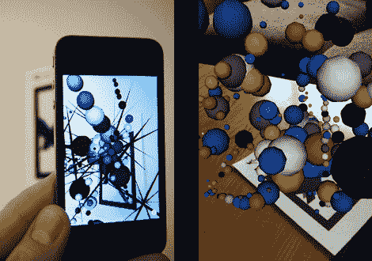

# 吹口哨让艺术流动

> 原文：<https://hackaday.com/2011/04/01/whistle-to-make-the-art-flow/>

来自[James]的一个新项目针对 iPhone，在增强现实环境中使用这种野生的[生成艺术](http://jamesalliban.wordpress.com/2011/03/30/konstruct-ar-iphone-app/)(免费)应用程序，用于运行 iOS 4+的 3GS 和 4。该组合由[字符串](http://www.poweredbystring.com/)增强现实库提供支持，并用 C + OpenGL 编写，呈现了一个强大的 AR 平台，在屏幕上提供超过 100，000 个多边形，帧速率没有明显下降。

艺术部分受到应用程序通过麦克风拾取的噪音的影响。对着设备说话、吹口哨或吹气会产生 3D 艺术，然后你可以自由地在三维空间中探索。看看它在一个自然嘈杂的环境中会有什么样的表现会很有趣。功能还包括各种 3D 形状，调色板和设置，可以混合创建“无尽”的组合，以及一个很好的保存快照功能。

休息之后加入我们，观看一个简短的视频，一定要看看[詹姆斯]的其他作品，比如[增强现实名片](http://hackaday.com/2009/07/15/augmented-reality-business-card/)

[https://player.vimeo.com/video/21537332](https://player.vimeo.com/video/21537332)