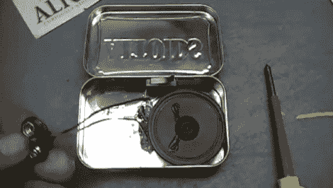

# 正好赶上愚人节的时候

> 原文：<https://hackaday.com/2011/03/31/screaming-altoids-tin-just-in-time-for-april-fools/>

制作人(Dino Segovis)已经开始了一个他称之为“每周黑客”的项目，他将在一整年内每周进行一次黑客活动或项目。他的视频系列的第一部分在愚人节的前两天完成，适当地涵盖了一个你可以用来恶作剧你的朋友的电路的建设。

“Altoids 尖叫器”是一个基于 555 定时器的简单电路，他将其内置于标准 Altoids 罐中。555 定时器用于在罐头打开时发出一声响亮的尖叫。这是通过在非稳态模式下连接 555，并将其连接到扬声器以输出声音来实现的。一个微型开关安装在罐子里，当盖子被打开时，它会发出“尖叫”。

虽然这不是我们见过的最复杂的赛道，但它绝对能完成任务，并且很容易在明天的庆典前建成。这是一个伟大的黑客办公室，图书馆，或任何其他安静的地方。

继续阅读观看[Dino]的第一个 [Hack a Week](http://hackaweek.com/hacks/) 视频演示恶作剧的构造。如果你对他的更多作品感兴趣，一定要看看这个[自动球发射器](http://hackaday.com/2011/03/15/automatic-ball-launcher-is-for-the-dogs/)和另一个 [555 尖叫玩具](http://hackaday.com/2011/02/15/screamer-doll-prank-toy/)。

[https://www.youtube.com/embed/q8fqwOllRVI?version=3&rel=1&showsearch=0&showinfo=1&iv_load_policy=1&fs=1&hl=en-US&autohide=2&wmode=transparent](https://www.youtube.com/embed/q8fqwOllRVI?version=3&rel=1&showsearch=0&showinfo=1&iv_load_policy=1&fs=1&hl=en-US&autohide=2&wmode=transparent)