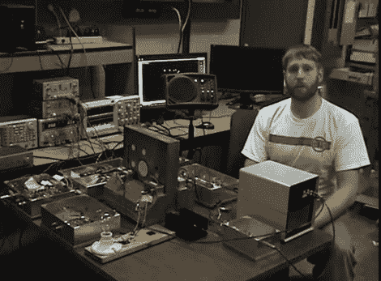

# 通过厚金属外壳传输电力和数据

> 原文：<https://hackaday.com/2011/04/01/transmitting-power-and-data-through-thick-metal-enclosures/>

假设你有一艘潜艇，或者一个有厚金属墙的核密封室。现在让我们假设你想通过这面墙传输电力或数据。显然，你不会想要钻孔，因为这面墙要么阻止海水进入，要么潜在的污染进入，但无线信号不会很好地穿过密集的金属。[Tristan Lawry]在 Lamelson-MIT Rensselaer 学生奖中的参赛作品试图通过使用超声波传输数据和能量来解决这个问题。

在休息后的视频中，Tristan 简要介绍了他的项目，然后演示了通过两英寸厚的钢板同时传输电力和数字音频。这是通过将一组压电传感器连接到板的内部和外部来实现的。通信起源于向一个换能器供电，该换能器通过材料发送超声波振动，由另一侧的对应元件接收。我们很容易理解以这种方式进行的数据传输，毕竟这就是[敲击块](http://hackaday.com/2009/10/02/clock-knock-block-full-of-puns/)接收信息的方式。我们不明白的是，它是如何“传输大量电能”的。如果你能用通俗易懂的语言解释它，请在评论中这样做。

 <https://www.youtube.com/embed/dc51vpEgoYA?version=3&rel=1&showsearch=0&showinfo=1&iv_load_policy=1&fs=1&hl=en-US&autohide=2&wmode=transparent>

 
[通过<a href="http://www.theregister.co.uk/2011/03/10/through_metal_comms_n_power_reinvented/page2.html" target="_blank">收银台</a>感谢拉里]
 </body> </html>