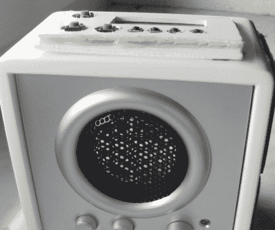

# 太阳能 MP3 播放扬声器

> 原文：<https://hackaday.com/2011/03/31/solar-powered-mp3-playing-speaker/>

[Valentin]前段时间买了一个小型电池供电的内置放大器的立方体扬声器，但没有太多耐心更换电池或给电池充电。它在架子上搁置了一段时间，直到他决定恢复他放在身边的一个旧 MP3 播放器。

他拆除了一对太阳能花园灯，保留了太阳能电池板、内置充电电路以及附带的充电电池。MP3 播放器被拆开，其组件被装入扬声器外壳。播放器的按钮用几根电线重新安置在音箱的外壳上，使他可以轻松控制音乐，而不必内置打开外壳的方法。扬声器和 MP3 播放器都由太阳能灯回收的电池供电，这就是为什么他选择在扬声器外壳的侧面安装两块太阳能电池板，而不是一块。

我们喜欢它，尽管扬声器目前看起来有点粗糙，特别是 MP3 播放器的按钮被移植了。然而，经过几分钟的修饰工作，它会看起来很棒。

如果你对更多的太阳能技术感兴趣，可以看看这个[太阳能垃圾机器人](http://hackaday.com/2011/02/20/solar-powered-junkbot/)，这些[儿童太阳能玩具](http://hackaday.com/2011/01/04/solar-monsters-you-know-for-kids/)，还有这个我们以前介绍过的[太阳能 WiFi 中继器](http://hackaday.com/2010/10/06/solar-powered-wifi-repeater/)。