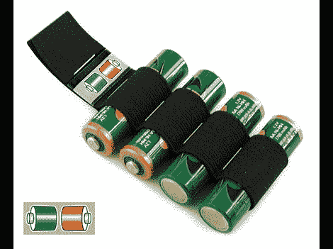

# 一目了然地管理您的可充电电池

> 原文：<https://hackaday.com/2011/04/02/manage-your-rechargeables-at-a-glance/>

如果你喜欢摄影、无线电遥控车辆或任何其他需要你随身携带多组可充电电池的活动，你就会知道如果你把一个没电的电池和充电的电池混在一起会有多痛苦。这种在现场管理电池的简单方法不需要花哨的电子设备、仪表或任何你可能想到的东西，只需要简单的贴纸和储物装置。

第一组标签贴在电池上，提供绿色和红色代码以及一个数字，因此很容易跟踪哪组电池去了哪里，并记录日期/寿命。第二组标签贴在你的储物盒上，当电池充满电后，把它放在盒子里，使正极面向储物标签上的绿色，当电池用完时，就把它翻过来。

虽然这主要集中在 AA 电池(甚至告诉你如何用一些橡皮筋和订书钉制作一个简单而有效的支架)，但这个想法可以用于任何类型的电池，快速浏览一下，看看你在果汁上的位置。