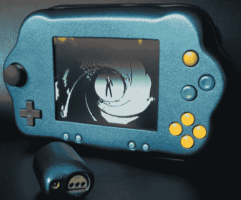

# 真棒便携式 N64 让你的游戏在手，看不见

> 原文：<https://hackaday.com/2011/04/01/awesome-portable-n64-keeps-your-games-in-hand-out-of-sight/>

[David]最近写信给我们，分享他在 ModdedbyBacteria 论坛上友好的人们的帮助下建造的便携式任天堂 64。我们对 [N64 便携式电脑](http://hackaday.com/2010/05/08/nimbus-portable-n64/)[并不陌生](http://hackaday.com/2011/03/17/n64boy-advance/)，因为[你可能已经注意到](http://hackaday.com/2010/01/25/gorgeous-portable-n64-built-to-order/)，但是这款手机太棒了，不能错过。

这款游戏机采用金属蓝色外壳，在我们见过的其他便携式 N64 mods 中非常突出。正如你所料，他削减了 N64 控制台和一些不同的控制器位，以适应他们的情况下，完成了一个 5 英寸的 PSOne 显示面板。一个小风扇从设备的背面伸出来，起初看起来不合适。然而，它不仅可以保持控制台凉爽，而且如果控制台放在平坦的表面上，它还可以充当一个“支架”。[David]还在控制台底部添加了一个加密狗，如果他愿意，可以使用外部 N64 控制器。

老实说，我们最喜欢的一个功能是，插入时，游戏卡带不会从机箱后面伸出来。他包括了足够的空间让游戏在玩的时候完全隐藏起来。干得好！

请继续阅读，查看他的便携式 N64 的视频构建日志和演示。

 <https://www.youtube.com/embed/2ZZNuM0pSQc?version=3&rel=1&showsearch=0&showinfo=1&iv_load_policy=1&fs=1&hl=en-US&autohide=2&wmode=transparent>

 </body> </html>