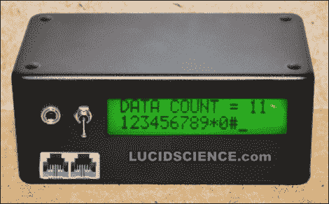

# 简单的 DTMF 解码器从 YouTube 视频中提取数字

> 原文：<https://hackaday.com/2011/04/02/simple-dtmf-decoder-pulls-numbers-from-youtube-videos/>

虽然我们中的许多人已经不再使用家里的固定电话，但今天仍然有相当多的人使用 POTS 线路。这些模拟电话系统使用双音多频(DTMF)信号，以可听方式显示电话键盘上的所有按键并拨打电话。LucidScience 的[Brad]认为手头有一个 DTMF 解码器会很有用，[并忙着建造一个](http://lucidscience.com/pro-phone%20number%20decoder-1.aspx)。

他的 DTMF 解码器盒使用 CM8870 DTMF 解码器芯片，你可能会认为这是完成工作所需的全部。这种芯片很好地履行了自己的职责，为它记录的每个按钮按压输出一个 4 位二进制代码，但如果不能以有意义的方式表示这些代码，这并没有太大的好处。他首先构建了一个试验板解码器电路，它会根据检测到的按钮按压来点亮 16 个 led 中的 1 个。这很好，但他认为 Arduino 驱动的 LCD 显示器会更好。

当他完成时，他有了一个带液晶显示器的紧凑型解码器盒，可以接受来自 RJ-11 电缆或音频插孔的输入。他说，音频插孔对于解码计算机音频(如 YouTube 剪辑)的音调特别有用。[Brad]称赞 CM8870 芯片，称它可以从几乎任何音频或电话信号中提取电话号码，而不管质量如何。我们认为它将为基于电话的安全系统提供一个很好的基础，如果你对此感兴趣的话。

请务必留下来看看他的双音多频解码器电路的行动。

 <https://www.youtube.com/embed/2gIwB_pdb00?version=3&rel=1&showsearch=0&showinfo=1&iv_load_policy=1&fs=1&hl=en-US&autohide=2&wmode=transparent>

 </body> </html>