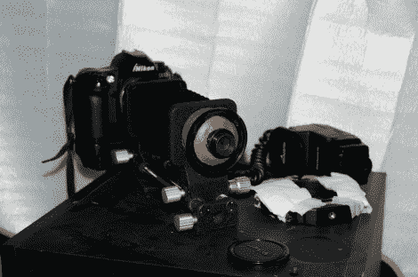
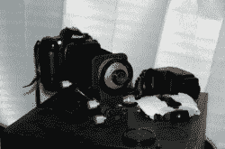
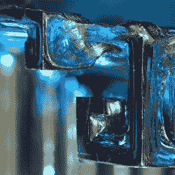
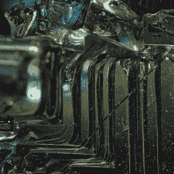

# 微距镜头和图像堆叠

> 原文：<https://hackaday.com/2011/04/02/macro-lens-and-image-stacking/>

[塞缪尔·萨金特]建造了他自己的镜头来制作堆叠的宏观图像。这个项目是他的毕业论文的一部分，利用了蔡司放大镜头。光圈环坏了，很难判断有多少光线进入相机。他没有把整个东西报废，而是把它转了过来，与其他几个部分结合起来，使它成为一个微距镜头。他使用了一个尼康 p b-5 below、一个 PK-13 伸缩管和一个机身盖来将镜头安装到他的相机上。用他的 Dremel 在身体上加了一个洞，大量的环氧树脂油灰封住了所有的缝隙。

休息过后，你可以看到几张[塞缪尔]用铋制作的照片。他通过拍摄一些测试照片来估计最清晰的焦距。接下来，他捕捉了一系列图像，在每次拍摄之间轻微移动风箱。最后，使用 [Helicon Focus](http://www.heliconsoft.com/heliconfocus.html) 图像堆叠软件来组合这组图像。也许为了他的毕业论文，他可以建造[一个自动移动主题的机械化平台](http://hackaday.com/2011/02/19/stackable-macro-photography-rig/)。

