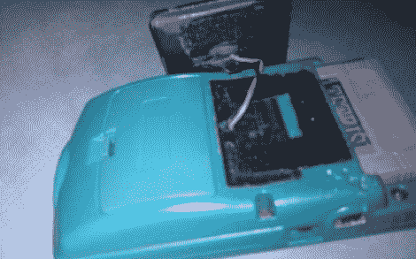

# 太阳能驱动的 GameBoy Color 永远不会没电

> 原文：<https://hackaday.com/2011/04/04/solar-powered-gameboy-color-never-runs-out-of-juice/>

Instructables 用户[Andrew]从一个朋友那里得到了一个免费的，但是损坏了的 GameBoy 颜色。朋友的狗在掌上电脑的外面做了很多，但它肯定是可用的。在更换了一些外壳后，[Andrew]决定他将尝试调整 GameBoy 来利用太阳能电池，以保持电池电量充足。

他花了 5 美元买了一盏太阳能庭院灯，然后把它拆开，小心翼翼地不要在拆卸过程中损坏粘得很紧的太阳能电池板。接下来 GameBoy 被拆开，太阳能电池板被焊接到手持设备的电池引线上。一旦电线正确穿过外壳，他就重新组装手持设备，并拿起一对可充电的 AA 电池进行测试。

[Andrew]告诉我们，太阳能电池板工作良好，只需将其面朝下放置，就可以让电池充满电，随时可用。

留下来看他的太阳能游戏机的快速视频演示。

 <https://www.youtube.com/embed/HPxrb7jX4Do?version=3&rel=1&showsearch=0&showinfo=1&iv_load_policy=1&fs=1&hl=en-US&autohide=2&wmode=transparent>

 </body> </html>