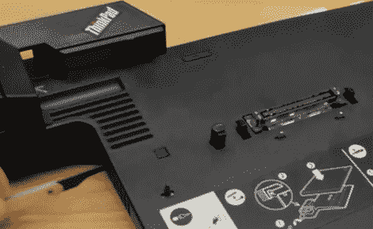

# Thinkpad 码头提货

> 原文：<https://hackaday.com/2011/04/04/thinkpad-dock-picking/>

德国曼海姆“RaumZeitLabor”黑客空间的黑客注意到，thinkpad mini dock 上的锁定机制[非常容易绕过](http://www.youtube.com/watch?v=PFLiyzZ_FyQ&amp;feature=channel_video_title)。作为一个额外的安全层出售，该机制本身并没有真正受到任何保护。启动它的按钮被一把钥匙锁住了，但插销没有固定住，可以通过侧面的通风口进入。他们在视频中使用了开锁工具，但他们说即使是一个长曲别针也足够了。

我们知道没有安全设备是完美的，如果有人真的真的想要，他们会接受，但这似乎有点太容易了。也许下一个版本会有一个小塑料墙来保护门闩不被手动启动。如果你主要关心的是安全问题，希望你用的是比挂锁更坚固的东西。

[经由 [RaumZeitLabor hackerspace](http://raumzeitlabor.de/) (谷歌[翻译](http://translate.google.com/translate?js=n&prev=_t&hl=en&ie=UTF-8&layout=2&eotf=1&sl=auto&tl=en&u=http%3A%2F%2Fraumzeitlabor.de%2F&act=url) )]

 <https://www.youtube.com/embed/PFLiyzZ_FyQ?version=3&rel=1&showsearch=0&showinfo=1&iv_load_policy=1&fs=1&hl=en-US&autohide=2&wmode=transparent>

 </body> </html>