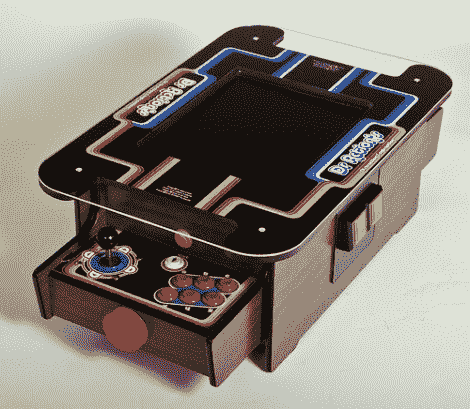

# 值得骄傲的鸡尾酒柜

> 原文：<https://hackaday.com/2011/04/05/cocktail-cabinet-to-be-proud-of/>

乍一看，你可能会认为这是真的，但如果你仔细看，你会发现这个分散注意力的装置是一个非常好的鸡尾酒柜娱乐，它有一个 MAME 设置。[Sam Freeman]拍下了整个构建过程的照片，[将它们连同说明一起发布到 Flickr 收藏中](http://www.flickr.com/photos/11834044@N04/sets/72157626430757634/with/5591784934/)。

这个项目是在受到这个小型鸡尾酒柜的启发后开始的。他想要自己的版本，在规模上更接近几十年前在酒吧里发现的投币式版本。他使用谷歌 Sketchup 设计了这个箱子，以适应 17 英寸的液晶显示屏。从那里，他切断了部分和路线的边缘。正如你所料，控制功能包括按钮和操纵杆，但末端的红色盖子是一个旋转器。他尝试了几种不同的辅助控制方法。他发现使用乐高齿轮将旋转器的运动映射到鼠标的轴上效果最好。为了给塑料旋钮一个更好的感觉，他在上面放了一些硬币来增加质量，让动量发挥作用。最终的外观是用木纹接触纸和定制的印花皮革制成的。