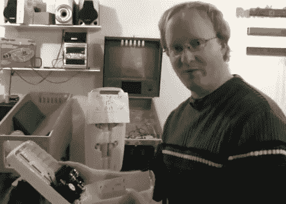

# 和本·赫克一起破解自动洗手液

> 原文：<https://hackaday.com/2011/04/05/hacking-automated-hand-sanitizers-with-ben-heck/>

如果你最近去过医院，你可能会注意到在走廊和每个病人的房间里都有很多自动洗手液分配器。由于医院获得性感染是一个日益严重的问题，所有工作人员都被要求定期使用这些洗手液，以减少疾病传播的可能性。

在他的网络节目的最近一集[中，【Ben Heck】接受了挑战，黑进了其中一个分配器，使用运动传感器来感知何时医院人员在附近，以及提醒他们在离开时应该消毒他们的手。](http://revision3.com/tbhs/sanitizer)

他拆卸了分配器，看看它是如何工作的，然后用一套运动探测器取代了红外传感器对。他将运动传感器连接到一个螺旋桨板上，螺旋桨板使用一个单独的附加板来计时。一旦运动传感器被触发，在机器通知他们友好地消毒他们的手之前，给过路人一个时间窗口。所有移动和消毒剂分配事件都被记录到与控制器相连的 SD 卡中，可对其进行检查以确保符合政策。

如果你有 20 分钟的空闲时间，这是值得一试的，如果你对更多的洗手技术感兴趣，看看我们不久前推出的 DIY 干手器。