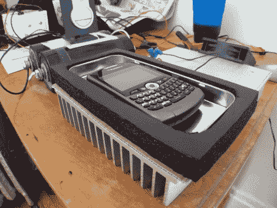

# 冷却您的手机以延长电池寿命？

> 原文：<https://hackaday.com/2011/04/05/chill-your-phone-for-longer-battery-life/>

选择手机时，我们首先关注的是电池寿命。我们知道，最终我们会看到性能下降，而[韦斯特博士]想看看是否有办法推迟不可避免的事情。他发现环境温度会影响电池的整个寿命。他着手建造一个电话冷却器来减缓电池的退化。

他指出的研究表明，在室温下，锂电池每年会损失 20%的容量。这似乎是一个可疑的数字，所以不要在评论中分享其他研究的链接。不管这 20%是对是错，关键是冷却电池会保护它。考虑到这一点，[韦斯特博士]组装了一个使用帕尔贴冷却器和散热器的豆荚，以便在他睡觉时托管他的黑莓手机。他认为他可以将每年的容量损失从 20%降低到 14%。这当然是以每天晚上运行那个冷却器为代价的(除了在需要的时候给手机充电)。但是也许这个解决方案会激发出一个更好的想法。