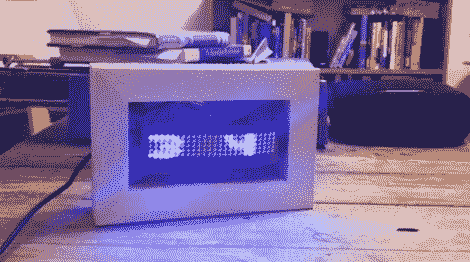

# 逆向工程 LED 伏特加瓶显示器

> 原文：<https://hackaday.com/2011/04/06/reverse-engineering-led-vodka-bottle-displays/>

当[Tyler]听说美狄亚伏特加在他们的瓶子里安装了 LED 矩阵显示屏时，他立即想得到一个。谁能责怪他呢？有人终于把我们钟爱的两样东西结合起来了:酒和发光二极管。

他花了很长时间才在当地的任何一家商店找到一瓶酒，但当他外出购物时，终于遇到他们的一名销售代表宣传该品牌时，他兴奋极了。

一回到家，他就把显示器从瓶子上拉下来，开始四处查看是什么让它滴答作响。显示器由柔性 PCB 制成，用一些透明的弹性薄膜贴在瓶子上。它由两节 CR2032 电池供电，由 PIC16F 芯片控制，该芯片从一个小型 Atmel EEPROM 中提取存储的信息。

一旦他想出了如何控制 LED 矩阵，他就上传了自己的字体，并添加了一个 LINX 无线模块[，以远程向电路板](http://fr.ac.tl/blog/2011/02/03/wireless-atmega8-led-display/)发送信息。他把它安装在一个木头框架里，现在把它当作一个简单的帐篷展示。

如果你有一个这样的显示器挂在你的房子周围，一定要去他的网站看看他的无线接口板的原理图以及他用来驱动字幕的代码。你也可以在那里观看展示视频。