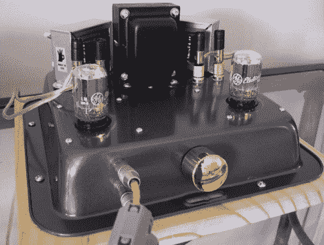

# 烤盘电子管放大器听起来比你想象的要好

> 原文：<https://hackaday.com/2011/04/06/baking-pan-tube-amp-sounds-better-than-youd-expect/>

几年前，[Gio]决定尝试制作几个电子管放大器。

[第一个放大器更像是一个实验](http://diyaudioprojects.com/Tubes/6T9-Tube-Amp-Kit/),看看 DIY 单端电子管放大器的声音效果如何。该放大器基于业余小发明创造的 6T9 设计，并结合了一对 6T9 真空管，因此得名。他在一个下午就把东西装好了，然后忙着在烤盘上钻孔，在那里他安装了放大器。请忍耐一下，事情没有听起来那么糟。放大器实际上看起来很好，安装在黑色钢上，这种外壳比大多数 DIY 放大器外壳便宜得多。他说，他一定会格外小心地将所有电子元件从金属机箱中分离出来。

[第二个放大器](http://diyaudioprojects.blogspot.com/2008/09/ultra-linear-6t9-diy-tube-amplifier.html)用于测试五极管模式和超线性模式配置之间的性能差异。虽然两个放大器共享大量相同的组件，但他的 UL 放大器受益于略好的电容器和提升的电源，更不用说更传统的情况。

根据[Gio]的说法，这两种放大器听起来都很棒，但应该与高效扬声器搭配才能获得最佳体验。他指出，除了安装选项，超线性放大器是更好的选择。

[谢谢，菲利普]

[通过[倒退](http://www.retrothing.com/2008/07/build-a-baking.html)