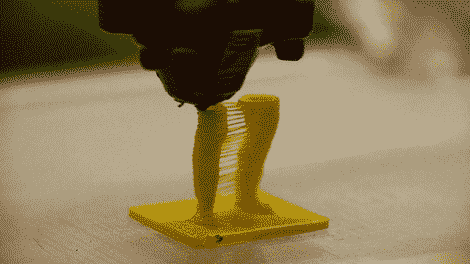

# 艺术装置让你成为自己的纪念品

> 原文：<https://hackaday.com/2011/04/07/art-installation-lets-you-be-your-own-souvenir/>

[blablab]的团队一直在努力工作他们的最新项目，[他们在巴塞罗那的大街上发布了这个项目](http://vimeo.com/21676294)在兰布拉步行街。他们的艺术装置可以让你在商场中央摆好姿势，并收到一个你自己的塑料雕像作为纪念品。

与我们不久前看到的“ [Fabricate Yourself](http://hackaday.com/2011/02/28/encase-yourself-in-carbonite-with-kinect/) ”装置不同，这个项目也使用 Kinect 来创建对象的 3D 表示，尽管它使用了三个独立的传感器，而不是一个。每个传感器都位于一个中央平台周围，创建一个完整的 3D 模型，然后发送到附近的 RapMan 3D 打印机。

然后每个用户都会得到一个他们自己的塑料模型带回家——这几乎就像一个互动的人类模型。虽然这些数字很简洁，但如果能看到使用更高分辨率的 3D 打印机可以制作出什么样的塑料雕像就太棒了，就像我们一周前展示的那台。

看看下面的视频，看看纪念品打印机的运作。

【维梅奥 http://vimeo.com/21676294 w = 470】