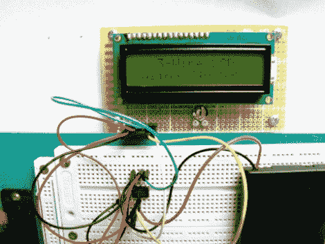

# 移位寄存器是制作三线串行 LCD 所需要的全部

> 原文：<https://hackaday.com/2011/04/07/shift-register-is-all-it-takes-to-make-a-3-wire-serial-lcd/>

这个技巧有点老了，但是这个设置的一个方面值得分享。当您需要增加可用的 I/O 引脚数量时，移位寄存器是一个包含在项目中的常见组件。我们以前用它们来驱动 LCD 屏幕，但是我们从来没有意识到你可以使用 595 芯片来制作三线串行 LCD 接口。这是因为我们一直认为移位寄存器有三个必须寻址的控制引脚:数据、时钟和锁存器。但似乎事实并非如此。这种黑客将时钟和锁存引脚(在该芯片上称为存储寄存器时钟输入)捆绑在一起。这使得移位后的数据在移入芯片后一个时钟周期被锁存到输出寄存器。

这意味着你可以只用两个管脚来操作 595 芯片，但是，唉，你确实需要多一个连接来正确地驱动 LCD。这是一款符合 HD44780 标准的显示器。它正在 4 位模式下使用；四个移位寄存器引脚提供该数据，第五个引脚控制寄存器选择引脚。由于来自 595 的移位数据在每个时钟选通脉冲后出现在引脚上，因此您必须单独控制 LCD 上的 Enable 引脚，否则它会偶尔出现。

现在，你可以用一个 0.42 美元的器件控制一个只有 3 个引脚的 HD44780 显示器了。我们对你来说是不是有点太快了？看看这个 [595 教程](http://hackaday.com/2010/05/31/beginner-concepts-cascading-shift-registers/)，试试[移位寄存器模拟器](http://hackaday.com/2011/03/14/beginner-concepts-595-shift-register-simulator/)。这应该能让你跟上进度。

[谢谢拉詹德拉]