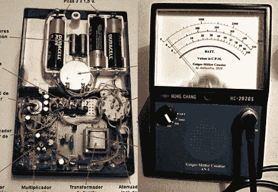

# 装在欧姆表外壳中的盖革计数器

> 原文：<https://hackaday.com/2011/04/07/geiger-counter-built-in-an-ohmmeter-enclosure/>

这里有一个盖革计数器，它在一个旧的欧姆表 ( [翻译](http://translate.google.com/translate?js=n&prev=_t&hl=en&ie=UTF-8&layout=2&eotf=1&sl=auto&tl=en&u=http%3A%2F%2Fsites.google.com%2Fsite%2Fanilandro%2F04010-geiger-01))里就像在自己家里一样。[Anilandro]着手建造这个辐射探测器，以了解它们是如何工作的。就像[我们看到的其他 diy 盖革计数器](http://hackaday.com/2011/03/19/more-radiation-test-gear/)一样，这个项目组装了一个电路来与充气管接口，充气管充当探测器。[Anilandro]用几个段落来讨论这是如何工作的；盖革管基本上是一个电容器，当电离粒子穿过它时，它的电特性会发生变化。

一旦他想出了理论，他就收集一些零件来使用。一盏坏了的应急灯捐赠了它的变压器来提供所需的高压。电路的其余部分建立在一些原型板上，并添加了一个扬声器来输出咔嗒声，这已经成为探测器硬件的一个熟悉部分。该管本身被容纳在通过电缆连接到基本单元的棒中。休息后，查看一些已完成单元的测试片段。

 <https://www.youtube.com/embed/nrImIHO2Mng?version=3&rel=1&showsearch=0&showinfo=1&iv_load_policy=1&fs=1&hl=en-US&autohide=2&wmode=transparent>

 
[谢谢 J]
 </body> </html>