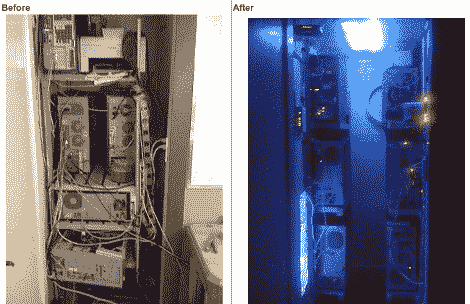

# 从杂乱的储藏室转变为梦幻般的数据中心

> 原文：<https://hackaday.com/2011/04/08/friday-converting-from-clutter-closet-to-dreamy-datacenter/>

[DocDawning]有一个很好的家庭网络，并且正在运行，但是容纳硬件的脏乱坑使他避开了房子的那一部分。为了减少噪音，清理杂物，他在一个小壁橱里为自己建了一个非常漂亮的数据中心。

设置中最大的变化之一是提供足够的冷却。他在壁橱和走廊共用的墙上开了一个通风孔。对于几个将空气吸入封闭空间的大型冷却风扇来说，这个尺寸刚刚好。但是冷空气的进入必须伴随着热空气的流出，所以他在天花板上增加了一个排气口。这也得到了三个大粉丝的支持，正如你在上面看到的，集成的 led 充当了服务器群的光源。

该计划的最后一部分包括安装在外壳壁上的机器专用支架。这些架子是用 1×1 的白木材制成的。它们将硬件固定在适当的位置，留出足够的空间来敷设电缆。新的设置甚至开辟了足够的墙壁空间来安装电源和网络硬件。现在一切都有了自己的位置，[DocDawning]终于可以关上他那些嘈杂的服务器的大门了。