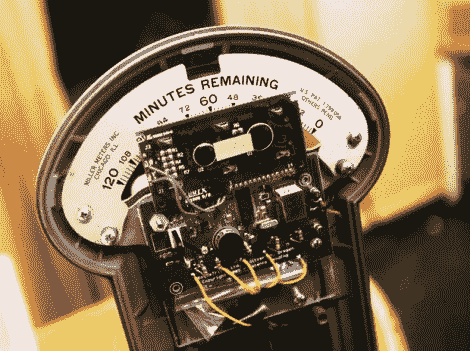

# 市长是一名黑客，想使用 DIY 停车计时器

> 原文：<https://hackaday.com/2011/04/08/mayor-is-a-hacker-and-wants-to-use-diy-parking-meters/>

俄勒冈州西尔弗顿市的市长是一名黑客，他想在镇上的停车计时器中使用自己的硬件。这并不是说他认为他可以比销售现代咪表的公司做得更好(尽管那些出现了[显著的问题)，而是他想保留正在被取代的 20 世纪 40 年代停车咪表的情感。这些咪表被称为便士停车咪表，因为你只需花一便士就可以得到 12 分钟的时间。](http://hackaday.com/2009/07/30/black-hat-2009-parking-meter-hacking/)

由于维修机械咪表和从每个咪表中收集硬币的相关成本，许多市政当局已经将停车支付系统数字化。这个黑客旨在保持老式仪表的外观，但用数字屏幕取代机械读数。计价器仍然会提供合理的停车交易；免费五分钟。更换内部构件的成本估计为每米 150 美元…如果他们考虑 250 台的运行，这似乎有点高。我们看到的这个想法的主要问题是，最初的停车计时器主体没有可以接受 25 美分硬币的槽。

[谢谢里克]