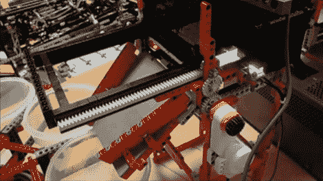

# NXT 机器自动分拣乐高积木

> 原文：<https://hackaday.com/2011/04/08/nxt-machine-sorts-lego-blocks-automatically/>

聪明的人不会把他们的玩具放好，他们会制造机器为他们做这件事。案例及要点:[这个可以给乐高积木排序的 NXT 项目](http://www.youtube.com/watch?v=6lZ9rSZwDzE)。只需将一桶随机石块倒入机器一端的料斗中。一次一片，这些塑料片将被提升到由几条不同的传送带组成的传送系统上，这样就可以分离各个部分。一次一个积木，每个积木进入一个特别照明的房间，在那里它们可以通过 NXT 积木进行视觉识别。一旦它识别出该块，一个塑料容器转盘旋转，将该块正确地放置在上面看到的输出拍摄下方。

那么我们现在有一个完整的乐高生命圈吗？不完全是。你可以使用一台 3D 乐高打印机自动构建结构，这种分类器将毫无问题地为此目的组织部件。但是我们仍然需要一台可以将组装好的砖块拆开的乐高机器。

 <https://www.youtube.com/embed/6lZ9rSZwDzE?version=3&rel=1&showsearch=0&showinfo=1&iv_load_policy=1&fs=1&hl=en-US&autohide=2&wmode=transparent>

 
[通过<a href="http://tinkernology.blogspot.com/2011/03/monstrous-lego-sorting-machine.html" target="_blank">修补技术</a>
 </body> </html>