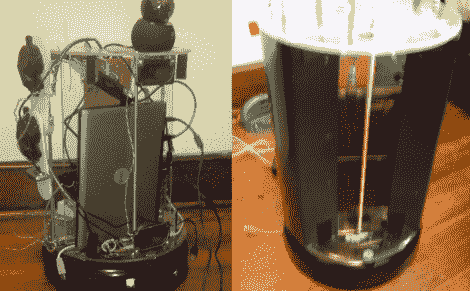

# 独眼独臂金属滚动机器人 Roomba

> 原文：<https://hackaday.com/2011/04/07/one-eyed-one-armed-metal-rolling-roomba-robot/>

[Erik]正在寻找一个坚固的机器人平台,最初考虑的是 iRobot Create，直到他发现他可以以很低的价格获得 Roomba Discovery 系列。该发现包括一个电池，这是 iCreate 所缺少的，尽管它也包括所有的标准真空位。

他一拿到 Roomba，就立即拆除了所有的真空部件，并开始添加支撑结构来容纳机器人的其余组件。机器人通过位于 Roomba 底座顶部的一台小型笔记本电脑进行控制，并配有一个平移和伸缩网络摄像头，可以向操作员提供反馈。

这个机器人已经建造了一年多了，在此期间已经进行了几次升级。原来的笔记本电脑换成了更新的双核型号，网络摄像头升级到了具有运动跟踪功能的型号。整个东西都被薄金属板包裹起来，看起来很光滑，他还增加了一个伺服驱动臂。

这个项目还没有完全完成，他也没有真正说明他打算用这个机器人做什么，但目前看起来不错——我们迫不及待地想看到它完成。