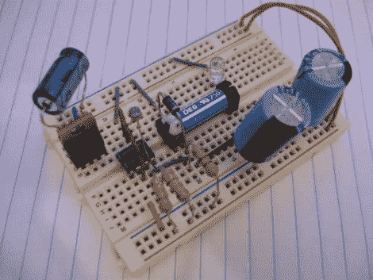

# 用于节能应用的光感测电路

> 原文：<https://hackaday.com/2011/04/08/light-sensing-circuit-for-power-saving-applications/>

Instructables 用户[MacDynamo]正在考虑家庭安全系统，并想知道这种系统通电但未激活时会浪费多少电力。他思考了一会儿，然后设计了一个电路，可以用来根据一天中的时间打开或关闭安全系统，但不需要使用任何类型的时钟。

他的系统依赖于一个配置为施密特触发器的 555 定时器，一个光敏电阻连接到 reset 引脚。当环境光水平下降足够大时，reset 引脚上的电阻增加，555 定时器脱离其复位环路。这导致电路接通与其相连的任何设备的电源。当太阳升起时，reset 引脚上的电阻下降，555 定时器不断复位，直到再次变暗。他指出，如果将光敏电阻放在触发引脚而不是复位引脚上，这种行为很容易逆转。

我们喜欢这个想法，尽管我们对将它用于任何真正的安全系统有点担心。一个错误的昆虫或碎片可能会导致系统开启，如果有人用手电筒关闭我们的警报，我们会觉得很愚蠢。也就是说，这种电路在家庭安全领域之外仍有大量实用的节能应用。