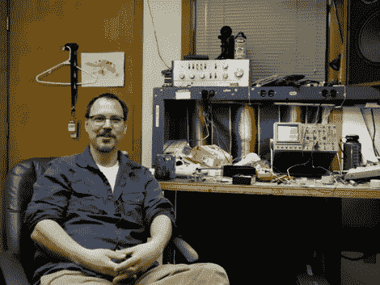

# 根据 Pete 的说法——新的在线视频系列

> 原文：<https://hackaday.com/2011/04/09/according-to-pete-new-online-video-series/>

这位是[Pete Dokter]，Sparkfun 的第四位员工，现任工程总监。如你所见，他们不让彼得出洞。他们没有设计新的突破板，而是给了他一台相机，他将用它来记录他偶尔的演讲。《据皮特说》将成为一档定期播出的在线节目，他在节目中回答来自互联网的问题。我们不得不承认，第一集，在休息之后嵌入，有点内容单薄——仅仅作为一个介绍。但是我们认为皮特有着令人愉快的态度，我们期待着这个谦虚的开始能开花结果。

我们长期以来一直是以工程为导向的在线节目的粉丝，如[达夫·琼斯] [EEVBlog](http://hackaday.com/2010/09/03/eevblog-dissects-a-kindle-3/) ，[比尔·哈马克] [，[克里斯·甘梅尔，达夫·琼斯和杰夫·基泽]合作的](http://hackaday.com/2011/03/17/bill-hammack-explains-how-led-backlit-lcd-monitors-work/)[的 Amp Hour](http://www.theamphour.com/) ，[杰里·埃尔斯沃思] [A-Z 视频](http://hackaday.com/2011/02/15/a-z-of-electronics-capacitors/)和她即将推出的系列节目【本·赫克的】[本·赫克秀](http://hackaday.com/2011/04/05/hacking-automated-hand-sanitizers-with-ben-heck/)……我们可以继续。

有了这样的产品，您无需等待传统电视过渡到 IP 交付。别再看废话了，开始看这些有趣的节目吧。

 <https://www.youtube.com/embed/vsQvoIsc9Qk?version=3&rel=1&showsearch=0&showinfo=1&iv_load_policy=1&fs=1&hl=en-US&autohide=2&wmode=transparent>

 
[谢谢卢克]
 </body> </html>