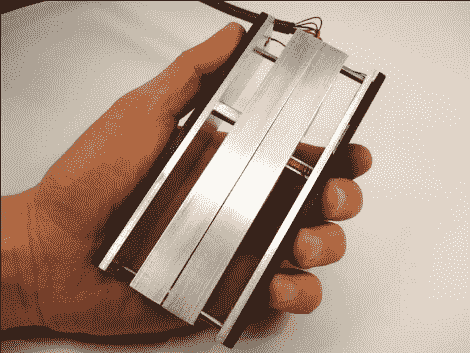

# 我们未来会有带触觉反馈的手机吗？

> 原文：<https://hackaday.com/2011/04/10/are-phones-with-haptic-feedback-in-our-future/>

我们能不能去掉键盘，只用手机来查看信息和拨打电话？[Sidhant Gupta]一直在研究一种电子可调弹簧机构的想法，这可能会使这成为可能。他称这个原型为挤压块。如果你拿起它并挤压它，你可以感觉到弹簧反推你的手指，但这都是一个骗局。在里面，你会发现一个带齿轮的马达，将直线运动转化为旋转力。与齿轮连接在同一根轴上的是一个马达和一个旋转编码器。微控制器监控该编码器，以检测用户将两块板挤压在一起，然后驱动电机来改变电阻。[Sidhant]概述了一些可能的用途，包括当未读邮件开始堆积时更强的抵抗力，或者将设备挤压到最小尺寸以将铃声音量一直调低。

仅仅因为功耗问题，我们对手持设备的这一功能有点怀疑。但是如果这一点被克服了，我们认为这将会成为一个非常有趣的手机功能……至少开始是这样。点击上面的链接观看视频演示或从[研究报告](http://www.cs.washington.edu/homes/sidhant/docs/SqueezeBlock.pdf)中获取详细信息(PDF)

[谢谢丹]