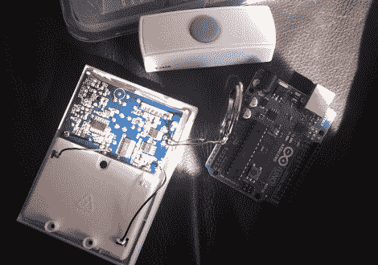

# 咆哮的门铃让你知道客人已经到达

> 原文：<https://hackaday.com/2011/04/09/growling-doorbell-lets-you-know-guests-have-arrived/>

[Sean]正在网上闲逛，没有找到什么特别的东西，这时他发现一个邮箱被黑客攻击，通知房主邮件已经送达。因为他的邮件是通过门上的一个小孔投递的，所以他不需要黑客，但是类似的事情很快就浮现在他的脑海里。

他的狗不太喜欢访客，他认为如果他在门铃上安装电线，通过 iPhone 通知他有客人，他可以省去一点悲伤(和许多不必要的吠叫)。他顺便去了当地的五金店，买了一个无线门铃。它很快被拆开，连接到他为另一个项目准备的 Arduino 上。通过调整他在网上找到的一些代码，他很快就让门铃与 Arduino 对话，并准备将其与他的 iPhone 接口。他决定通过 Growl 向他的手机发送通知，并在网上找到了一个接近他所需的 Perl 脚本。几个调整后，他有一个咆哮的门铃。

正如你在下面的视频中看到的，它工作了，尽管在通知中似乎有一点延迟。我们不认为在他到达门口之前就把他的客人送走是足够的，但是通过一些小的修改可以减少这种延迟。

至于引发这一切的帖子，我们很确定就是这个帖子。

 <https://www.youtube.com/embed/gaipAeS--LQ?version=3&rel=1&showsearch=0&showinfo=1&iv_load_policy=1&fs=1&hl=en-US&autohide=2&wmode=transparent>

 </body> </html>