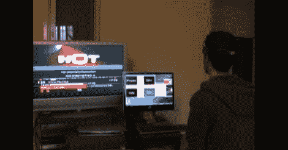

# 家庭中基于脑电波的辅助技术

> 原文：<https://hackaday.com/2011/04/10/brainwave-based-assistive-technology-in-the-home/>

肌萎缩性侧索硬化(ALS)是一种使人虚弱的疾病，最终导致患者失去对其运动功能的所有控制，同时保持其智力完好。患有这种疾病的人通常只能活几年，然后就会死于这种疾病。然而，在某些情况下，患者可以在最初诊断后存活很长时间，在这些情况下，辅助技术成为他们生活中的一个关键组成部分。

以色列 Ort Hermalin 大学的学生阿龙·布凯和奥菲尔·便雅悯在他们的导师阿姆农·德姆里的指导下，一直在努力为 ALS 患者创造一个由脑电图控制的智能房屋。他们项目的核心是利用脑电波控制日常家居用品。他们使用一种 Emotiv EPOC 脑电图耳机，当用户专注于电脑屏幕上显示的几个大按钮时，该耳机会监测用户的脑电波。这些按钮被映射到不同的功能，从开灯和关灯到改变有线电视盒上的频道。当用户专注于一项特定的任务时，计算机会分析耳机的输出，并将命令传递给适当的设备。

截至目前，脑电图控制的家只是他们学位项目的一个项目，但我们希望他们的努力有助于推动这一研究领域的进一步发展。

继续阅读，观看演示他们的脑电图控制智能房屋的视频。

 <https://www.youtube.com/embed/UJ-mkT6qw9Y?version=3&rel=1&showsearch=0&showinfo=1&iv_load_policy=1&fs=1&hl=en-US&autohide=2&wmode=transparent>

 <iframe class="youtube-player" width="800" height="480" src="https://www.youtube.com/embed/mQrytBbSbsA?version=3&amp;rel=1&amp;showsearch=0&amp;showinfo=1&amp;iv_load_policy=1&amp;fs=1&amp;hl=en-US&amp;autohide=2&amp;wmode=transparent" allowfullscreen="true" style="border:0;" sandbox="allow-scripts allow-same-origin allow-popups allow-presentation"/> </body> </html>