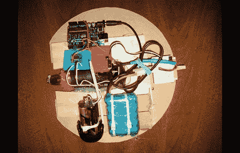

# 由电动工具和宠物玩具构成的球机器人

> 原文：<https://hackaday.com/2011/04/11/ball-bot-constructed-from-power-tools-and-pet-toys/>

Hackaday 论坛成员[machinelou]说他对遥控仓鼠球着迷已经有一段时间了。受到他在 BBC 节目中看到的球机器人的启发，他最终拿起一个 12 英寸的塑料球[并开始工作](http://forums.hackaday.com/viewtopic.php?f=3&t=548)。

他使用一个小钻头来提供滚动球所需的动力，Arduino 被用作该设备的大脑。这是他在简单的 I/O 和伺服控制之外的第一个主要项目，所以他进展缓慢。虽然这一切对他来说有点新鲜，但正如你在下面的视频中看到的，他已经将事情做好并运行到一定程度。在当前状态下，球被编程为向前和向后滚动几秒钟，然后继续休眠。

他的未来计划包括增加一个伺服控制的重量，让他能够控制球，以及使用一对 Zigbee 模块来远程控制球。

这是一个简洁的小项目，肯定会受到孩子们的喜爱。留下来看看他的机器人迄今为止的进展的快速视频。

 <https://www.youtube.com/embed/Vuj8q_J-eRM?version=3&rel=1&showsearch=0&showinfo=1&iv_load_policy=1&fs=1&hl=en-US&autohide=2&wmode=transparent>

 </body> </html>