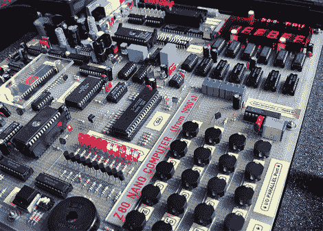

# 家酿 Z80 电脑令人敬畏

> 原文：<https://hackaday.com/2011/04/12/homebrew-z80-computer-inspires-awe/>

我们永远不知道它是如何错过我们的。

[GG]用了两年多的时间，用 20 世纪 80 年代的技术为自己建造了一台复古风格的 Z80 纳米计算机。该计算机位于我们在项目中见过的最大的一块 perfboard 上，使用 2.5MHz 的老式 Z80 CPU、8K ROM、16K RAM、RS-232 和并行端口、EPROM 刻录机和用于 32 位浮点运算的 AM95 数学协处理器。

我们以前见过几台自制电脑，包括 Z80 [笔记本电脑](http://hackaday.com/2010/11/08/the-v4z80p-the-8-bit-laptop/)，但这次让它们大吃一惊。对于他的电脑，[GG]创造了 8BASIC，一个基本的解释程序，充分利用六个 7 段显示器和八个 16 段显示器。显示器并不是一个真正的限制，因为[GG]也在 Visual Basic 中组装了一些东西，这样他的 PC 就可以和他的纳米计算机通信。

[GG]甚至在 ROM 和 RAM 上包括了错误检测，以及一个板载电源。如果你不能钦佩投入其中的奉献精神，至少要钦佩伟大的网络色情片。我们只是很遗憾[GG]没有对他的项目做一个适当的报道。他肯定能教给我们一些东西。

【GG】跳完之后的作品视频。

 [https://www.youtube.com/embed/5HA3dGrgC_Q?version=3&rel=1&showsearch=0&showinfo=1&iv_load_policy=1&fs=1&hl=en-US&autohide=2&wmode=transparent](https://www.youtube.com/embed/5HA3dGrgC_Q?version=3&rel=1&showsearch=0&showinfo=1&iv_load_policy=1&fs=1&hl=en-US&autohide=2&wmode=transparent)