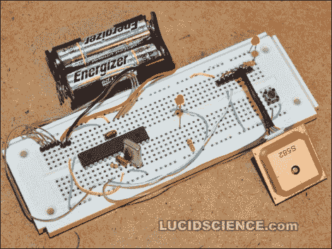

# 用 GPS 模块制作原型

> 原文：<https://hackaday.com/2011/04/12/prototyping-with-a-gps-module/>

[Oneironaut]正在用上面看到的原型测试一个新的 GPS 模块。这是一个圣何塞的导航设备，标识为 [FV-M8，由 Sparkfun](http://www.sparkfun.com/products/8266) 以不到 100 美元的价格出售。就是它挂在上面看到的试验板的右下角。他们在小巧的体积中融入了强大的动力，同时也让控制变得非常容易。虽然该器件是完全可配置的，但只需连接一条数据线(3.3V)和地，就可以从它那里获取串行数据。

[Oneironaut]通过将串行数据传输到字符 LCD 屏幕来测试它，然后将输出与他的手持 Garmin GPS 设备进行比较。你可以在休息后的视频中看到他描述他基于 ATmega32 的测试平台。我们已经习惯了在他的大部分项目中看到间谍技术，这将最终加入那些行列。他正在考虑组装一个磁跟踪模块，可以很好地与谷歌地球配合使用。

 <https://www.youtube.com/embed/SoMaAdQsGSE?version=3&rel=1&showsearch=0&showinfo=1&iv_load_policy=1&fs=1&hl=en-US&autohide=2&wmode=transparent>

 </body> </html>