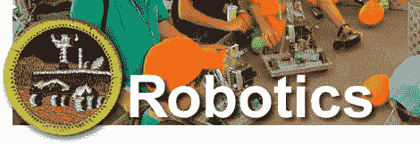

# 机器人功绩徽章刚刚宣布

> 原文：<https://hackaday.com/2011/04/13/robotics-merit-badge-just-announced/>

所以你知道如何建造机器人和给机器人编程；你想要什么，徽章？假设你是 11-18 岁，并且知道所有的秘密(或不那么秘密的)握手、宣誓和誓言，现在你就可以做到这一点。美国童子军[最近宣布](http://www.scouting.org/Media/PressReleases/2011/20110411.aspx)全新的[机器人功绩徽章](http://boyslife.org/section/about-scouts/merit-badge-resources/robotics/)。现在，在松木德比中打破规则建造[的孩子们可以尝试机器人套件了。](http://hackaday.com/2011/03/15/co2-powered-pinewood-derby-car-is-definitely-cheating/)

获得徽章必须满足的要求始于安全，终于探索与该领域相关的职业。一路上，童子军被鼓励学习在设计过程中保存工程笔记本，规划和编程硬件，并参加机器人比赛，如第一名 T1 或 T2 第三名 T3。

不难看出，这个奖状正合我们的胃口。我们只是希望它能从超级流行的徽章中吸引一些注意力，比如集邮、T2 篮和 T3。