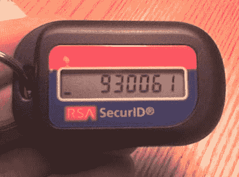

# RSA SecurID 双因素身份认证包括

> 原文：<https://hackaday.com/2011/04/13/rsa-securid-two-factor-authentication-comprimised/>

SecurID 是一种基于硬件的双因素身份认证系统。它要求您输入显示在硬件表链上的数字(如上图所示),以及您的其他登录信息。当用户远程登录公司的安全系统时，这被认为是一种非常安全的保护信息的方法。但是和其他事情一样，总有办法打破安全。听起来像是上个月[有人入侵了 SecurID](http://www.rsa.com/node.aspx?id=1002) 生产公司的服务器。

您需要从 RSA(EMC 的安全产品分公司)执行主席[Art Coviello]的来信中体会其中的含义。他承认有人窥探了他们的系统，他们得到了与 SecurID 系统相关的信息。他接着说，攻击者获得的信息并没有促进对 RSA 客户的直接攻击。

我们猜测攻击者可能有他们需要的东西来暴力破解 SecurID 系统，尽管他们现在可能有办法匹配哪个系统属于哪个客户。你对此事有什么看法？请留言告诉我们。

[via [Engadget](http://www.engadget.com/2011/03/18/rsa-hacked-data-exposed-that-could-reduce-the-effectiveness-o/)