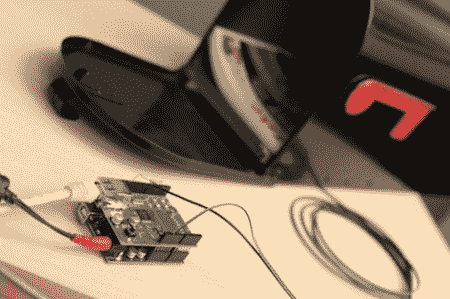

# 在 IPhone 上推送蜗牛邮件通知

> 原文：<https://hackaday.com/2011/04/15/push-notifications-for-snail-mail-on-an-iphone/>

Make 的[Matt]想出了一个方法，每当他的邮箱被打开时，就向他的 iPhone 发送[推送提醒](http://blog.makezine.com/archive/2010/12/snail-mail-push-alerts.html)。

电子设备只是一个安装在邮箱上的开关，通过以太网屏蔽连接到 Arduino，但有趣的部分是代码。[Matt]让 Arduino WebClient 请求服务器上的 PHP 脚本。这个脚本连接到 [Prowl API](http://www.prowlapp.com/) 将通知推送到 iPhone 上。

[Matt]的项目已经启动几个月了，我们仍然没有看到任何项目使用 Arduino+Push combo，或者除了 iPhone 之外的任何其他手机。我们认为这可以在 Android 手机上通过[云到设备消息](http://android-developers.blogspot.com/2010/05/android-cloud-to-device-messaging.html)来实现，但这不是唯一的解决方案。任何 hackaday 的读者都知道如何在 iOS 世界之外实现这一点吗？黑客阅读器会用一个可以向你的手机发送推送提醒的微控制器做什么？

[Matt]在休息后带领我们完成项目的视频

 <https://www.youtube.com/embed/W45c9UOvWSo?version=3&rel=1&showsearch=0&showinfo=1&iv_load_policy=1&fs=1&hl=en-US&autohide=2&wmode=transparent>

 </body> </html>