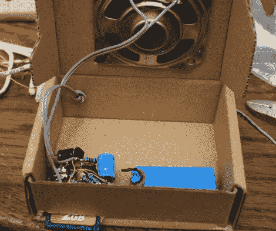

# 门铃黑客让同事不那么讨厌

> 原文：<https://hackaday.com/2011/04/14/doorbell-hack-makes-coworkers-less-annoying/>

Hackaday reader [Sprite_tm]在一个曾经容纳了几家企业的办公楼里工作，作为以前配置的残余，一个门铃就放在他办公室外面的走廊上。他的几个同事每次进办公室都以按门铃为乐。虽然他并不讨厌这种做法，但他已经厌倦了老一套的“叮咚”声，于是[决定来点儿改变。](http://spritesmods.com/?art=doorbell)

他想修改门铃，让它在被触发时发出随机的声音，但他时间紧迫，因为那天是 3 月 31 日，他想在愚人节那天安装好。在头脑中没有任何真正的计划或材料清单的情况下，他用手头所有的东西拼凑起来。

他使用了从 Elm-chan 借来的[设计，以便用 ATTiny85 播放 SD 卡中的 wav 文件，并使用 L293 H-Driver 作为临时的声音放大器。在解决了一些与电源相关的问题，并尽可能节省电路电池后，他宣布项目完成。他最初的目标是将所有东西都塞在 SD 卡插座的金属套管上(这太棒了)，但考虑到扬声器的尺寸和他为这个项目选择的电池，他最终将所有东西都塞到了一个纸箱里。](http://hackaday.com/2011/03/05/micro-audio-player-can-hide-behind-a-postage-stamp/)

我们并不太关心他是如何包装的，我们只是想知道他的同事对他的门铃增强功能有什么看法。最终，他们喜欢上了它，但是我们想象这并不能阻止他们一天多次按门铃。

留下来看看他的门铃黑客在行动的快速视频。

 <https://www.youtube.com/embed/FRsh-K8A_ws?version=3&rel=1&showsearch=0&showinfo=1&iv_load_policy=1&fs=1&hl=en-US&autohide=2&wmode=transparent>

 </body> </html>