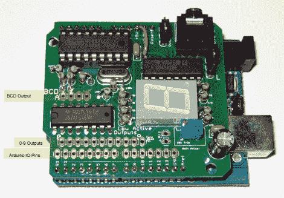

# 双音多频盾瞄准哈姆控制的 Arduino

> 原文：<https://hackaday.com/2011/04/17/dtmf-shield-aimed-at-ham-controlled-arduino/>

[Colin]想要一种通过业余无线电可靠地控制 Arduino 的方法。自动无线电控制最简单的方法之一是利用双音多频信号。对于那些对业余无线电不感兴趣的人来说，你可能认为 DTMF 是电话通信的按键系统。【科林】造了[一个屏蔽，有音频输入，可以解码 DTMF 信号](http://w2mh.wordpress.com/2010/06/03/dtmf-shield/)。

硬件基于 MT8870 DTMF 解码器芯片。这是 DTMF 硬件的流行选择，因为它为你做了所有的解码工作。每当检测到有效信号音时，它会在四个输出引脚上输出相关的二进制值。第五个引脚在每个新信号音后选通。[Colin 的]设计提供了大量关于输入信号的反馈。DTMF 值显示在 7 段显示器上(完全由硬件控制)，该值输出到二进制编码的十进制引脚，并映射到一组十个引脚，这些引脚接地以匹配接收到的数字。