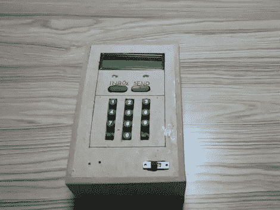

# Chatbox 无线即时消息客户端

> 原文：<https://hackaday.com/2011/04/17/chatbox-wireless-im-client/>

[Utpal Solanki]想要在舒适的沙发上进行一些文本聊天。他使用一个微控制器、一个字符 LCD 屏幕和一个他自己制作的键盘构建了这个他称之为 Chatbox 的无线聊天客户端。

该设备通过红外发射器和接收器进行通信。它使用[Utpal]制造的红外屏蔽与 Arduino 配对。每当手持设备接收到来自 Arduino 的消息时，它就会闪烁一对白色 led。然后你可以点击收件箱按钮，滚动阅读收到的内容。要回复，只需像使用手机一样在键盘上输入，然后点击发送按钮将信息发送回 Arduino。

在计算机方面，消息通过 USB 连接在 Arduino 之间传递。在视频演示的早期(休息后嵌入)[Utpal]展示了他的聊天框程序通过手持设备以与其他 messenger 程序相同的方式进行通信。

在我们看来，他已经建立了自己的非粉红色版本的 IM-ME 最初打算做的事情。

[https://www.youtube.com/embed/wCOJz_DnrfQ?version=3&rel=1&showsearch=0&showinfo=1&iv_load_policy=1&fs=1&hl=en-US&autohide=2&wmode=transparent](https://www.youtube.com/embed/wCOJz_DnrfQ?version=3&rel=1&showsearch=0&showinfo=1&iv_load_policy=1&fs=1&hl=en-US&autohide=2&wmode=transparent)