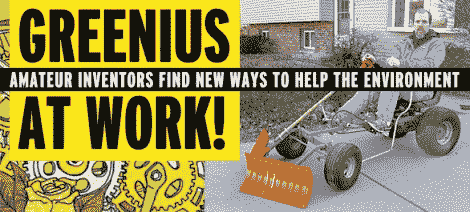

# 黑客得到了一个封面故事

> 原文：<https://hackaday.com/2011/04/17/hacking-gets-a-cover-story/>

我们确实不时在主流印刷媒体上看到黑客攻击，但你知道，当一群黑客在当地报纸上登上封面故事时，这场运动肯定正在积聚力量。本周发行的《地峡报》是威斯康星州麦迪逊的第一份免费报纸，报道了当地的黑客空间和一些绿色黑客。

上图中骑着[脚踏犁](http://www.thedailypage.com/isthmus/article.php?article=33189)的人是【凯文·布莱克】，总部位于威斯康星州滑铁卢的 Trek 自行车公司的机械工程师。他用一台骑马式割草机的底盘建造了这个钻机，在前面增加了 V 形的铲刃，还有从自行车上回收的曲柄和其他部件。

这篇文章通过采访本地黑客空间 [Sector67](http://www.sector67.org/) 的创始人【Chris Meyer】，继续对其进行特写。该报追踪了其他一些当地黑客(和 Sector67 成员)，他们一直在[制作风力涡轮机](http://www.thedailypage.com/isthmus/article.php?article=33191)的原型。

故事中最大的特色是【本·纳尔逊的】 [Geo Metro 电动汽车改装](http://www.thedailypage.com/isthmus/article.php?article=33188)。这位自由职业的视频制作人以大约 500 美元的价格买了一辆小型车，并在车库拍卖中买了一个叉车马达(新刷子 50+50 美元，相当于 100 美元的便宜货)。但这是这个项目最精彩的部分:在拆下汽车不需要的零件后，他以 550 美元的价格卖掉了它们。总之，该说的都说了，该做的都做了，他在这个项目上投资了大约 1300 美元，现在他有了一辆全电动汽车，时速可达 45 英里，充电一次可行驶 20 英里。也许[一个大的尾锥](http://hackaday.com/2009/12/25/aerodynamic-tail-makes-geo-metro-even-cooler/)将有助于扩展这个范围。

这是多年来我们在报纸上读到的最有趣的东西。也许你应该联系你当地的记者，在你的地区做一个专题报道？如果他们不接受，不要烦恼… [我们总是在 Hackaday](http://hackaday.com/contact-hack-a-day/) 上寻找优秀的构建。