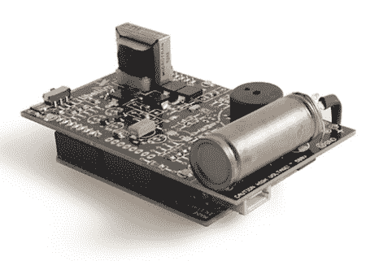

# Arduino 的辐射传感器护罩

> 原文：<https://hackaday.com/2011/04/17/radiation-sensor-shield-for-the-arduino/>

在福岛核事故后，Libelium 团队希望帮助日本人测量他们周围的辐射。由于 Arduino 平台的可负担性和似乎无处不在，他们上个月一直在努力工作，试图为 Arduino 推出他们的[盖革计数器传感器板](http://www.cooking-hacks.com/index.php/documentation/tutorials/geiger-counter-arduino-radiation-sensor-board)。我们认为他们做了出色的工作。

盖革管是一个非常简单的装置，但得到这个部件可能是一个相当昂贵的提议。令人欣慰的是，[Libelium]已经测试并验证了来自不同制造商的许多电子管——如果您不想被某个特定组件所束缚，这将非常有帮助。

这看起来正是[Seed 工作室]的人想要的那种东西，用于[开放式硬件辐射探测器](//www.seeedstudio.com/blog/2011/03/16/radiation-detector-help-needed/)，【Libelium】已经向东京黑客空间运送了第一批。很高兴知道需要帮助的地方会得到帮助。

中断后正在测试的传感器板的视频。

[https://www.youtube.com/embed/vm97_wn2Pac?version=3&rel=1&showsearch=0&showinfo=1&iv_load_policy=1&fs=1&hl=en-US&autohide=2&wmode=transparent](https://www.youtube.com/embed/vm97_wn2Pac?version=3&rel=1&showsearch=0&showinfo=1&iv_load_policy=1&fs=1&hl=en-US&autohide=2&wmode=transparent)