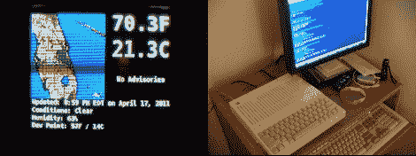

# 苹果 II 天气显示器(下)

> 原文：<https://hackaday.com/2011/04/19/apple-ii-weather-display-part-2/>



在 Apple II 天气显示的第一部分，我快速浏览了数据是如何获取和表达的。现在是时候在第 2 部分中使用它了。按照函数的顺序，我先做文本部分，虽然它与雷达图像的处理过程非常相似，但它是单色的，解释起来更简单。在我介绍它的工作原理之前，我应该解释一下我是如何分割 Apple II 的屏幕的。

Apple II 上的高分辨率模式为 280×160，底部有 4 行文本，或 280×192 全屏。我将使用 280×192 的全屏，因为尽管文本很有用，但它也会在更新时显示无休止的胡言乱语，而且由于 Apple II 设计的整个彩色视频模式是 NTSC hack，它在标准电视上显示彩色图形时并不那么漂亮。我还把屏幕分成 35 像素宽的“块”，这是我的编码系统造成的。

在没有进入高级 ASCII 或特殊字符的情况下，我决定使用 base 36 类型的编号系统，我们只需要 35 个唯一的字符来表示块中一行上的任何像素。值 1 表示给定块中的第一个像素，依此类推，Z 表示一个块中的第 35 个像素，整个屏幕最多 8 个块。块分隔符和其他函数可以使用小写字符发送，这是一个简单的纯文本系统。例如，如果苹果接收到 bbb123Z，这意味着跳到块 4，并在该块内的 1、2、3 和 35 处放置像素(并且如果对于该给定行没有任何像素，则发送 n)。

正在查看 text.lua …

```

-- Weather Underground to Apple //
-- 2011 Kevin Dady
--
-- Text to Graphics:
-- take text from web.data
-- make text images with image magick
-- phrase *.xpm files to apple //
-- send text images
-- end
text = {}
text.data = {}
text.data.input  = {}
text.data.packed = {{},{},{},{}}
text.data.apl2   = {{},{},{}}

text.createIMG = function()
if web.data[1] == nil then
web.data[1] = &quot;No Advisories&quot;
end
if web.data[3] == nil then
web.data[3] = web.data[7]
end
-- create the bottom text
cmd.imageMGK(&quot; -background black -fill white -font req/VeraMoBd.ttf&quot;..
&quot; -dither none -map req/mono.xpm -size 279x53 -pointsize 11 -gravity West&quot;..
&quot; caption:'&quot;.. web.data[2]..&quot;\n&quot;..web.data[6]..&quot;\n&quot;..web.data[5]..&quot;\n&quot;..web.data[3].. &quot;'&quot;..
&quot; temp/textBTM.xpm&quot;)
-- create the text for advisories
cmd.imageMGK(&quot; -background black -fill white -font req/VeraMoBd.ttf&quot;..
&quot; -dither none -map req/mono.xpm -size 139x64 -pointsize 11 -gravity Center&quot;..
&quot; caption:'&quot;.. web.data[1]..&quot;'&quot;..
&quot; temp/textALT.xpm&quot;)
-- create the text for temperature
cmd.imageMGK(&quot; -background black -fill white -font req/VeraMoBd.ttf&quot;..
&quot; -dither none -map req/mono.xpm -size 139x74 -pointsize 36 -gravity Center&quot;..
&quot; caption:'&quot;.. web.data[4]..&quot;'&quot;..
&quot; temp/textTMP.xpm&quot;)
end

text.convertIMG = function()
local files  = {&quot;textTMP.xpm&quot;,&quot;textALT.xpm&quot;,&quot;textBTM.xpm&quot;}
local footer = {82,72,61}
local width  = {140,140,280}
-- read the files into a table one at a time
for img = 1, 3 do
local file = io.open(&quot;temp/&quot;.. files[img],&quot;r&quot;)
table.insert(text.data.input, img, {})
for line in file:lines() do
table.insert(text.data.input[img], tostring(line))
end
file:close()
-- remove header
for y = 1, 7 do
table.remove(text.data.input[img], 1)
end
-- remove footer
table.remove(text.data.input[img], footer[img] - 7)
-- remove non pixel data
for y = 1, #text.data.input[img] do
text.data.input[img][y] = string.sub(text.data.input[img][y], 2, width[img])
end
end
end

text.sortIMG = function()
local newChar = &quot;&quot;
for img = 1, 3 do
-- need to convert the strings into tables
for y = 1, #text.data.input[img] do
table.insert(text.data.apl2[img], {})
-- for each column in the current row
for x = 1, #text.data.input[img][y] do
-- read the character at that Y,X point
newChar = string.sub(text.data.input[img][y], x,x)
if newChar == &quot;.&quot; then
table.insert(text.data.apl2[img][y], x) -- pixel
end
end
end
end
end

text.packageIMG = function()
for img = 1, 2 do
for y = 1, #text.data.input[img] do
local one   = &quot;&quot;
local two   = &quot;&quot;
local three = &quot;&quot;
local four  = &quot;&quot;
for x = 1, #text.data.apl2[img][y] do
if text.data.apl2[img][y][x] &lt;= 35 then
one = one .. string.sub(graphicsKey, text.data.apl2[img][y][x], text.data.apl2[img][y][x])
elseif text.data.apl2[img][y][x] &lt;= 70 then
two = two .. string.sub(graphicsKey, text.data.apl2[img][y][x] - 35, text.data.apl2[img][y][x] - 35)
elseif text.data.apl2[img][y][x] &lt;= 105 then
three = three .. string.sub(graphicsKey, text.data.apl2[img][y][x] - 70, text.data.apl2[img][y][x] - 70)
else
four = four .. string.sub(graphicsKey, text.data.apl2[img][y][x] - 105, text.data.apl2[img][y][x] - 105)
end
end
if one == &quot;&quot; and two == &quot;&quot; and three == &quot;&quot; and four == &quot;&quot; then
table.insert(text.data.packed[img], &quot;n&quot;)
else table.insert(text.data.packed[img],one..&quot;b&quot;..two..&quot;b&quot;..three..&quot;b&quot;..four)
end
end
end
for y = 1, #text.data.input[3] do
local one   = &quot;&quot;
local two   = &quot;&quot;
local three = &quot;&quot;
local four  = &quot;&quot;
local five  = &quot;&quot;
local six   = &quot;&quot;
local seven = &quot;&quot;
local eight = &quot;&quot;
for x = 1, #text.data.apl2[3][y] do
if text.data.apl2[3][y][x] &lt;= 35 then
one = one .. string.sub(graphicsKey, text.data.apl2[3][y][x], text.data.apl2[3][y][x])
elseif text.data.apl2[3][y][x] &lt;= 70 then
two = two .. string.sub(graphicsKey, text.data.apl2[3][y][x] - 35, text.data.apl2[3][y][x] - 35)
elseif text.data.apl2[3][y][x] &lt;= 105 then
three = three .. string.sub(graphicsKey, text.data.apl2[3][y][x] - 70, text.data.apl2[3][y][x] - 70)
elseif text.data.apl2[3][y][x] &lt;= 140 then
four = four .. string.sub(graphicsKey, text.data.apl2[3][y][x] - 105, text.data.apl2[3][y][x] - 105)
elseif text.data.apl2[3][y][x] &lt;=175 then
five = five .. string.sub(graphicsKey, text.data.apl2[3][y][x] - 140, text.data.apl2[3][y][x] -140)
elseif text.data.apl2[3][y][x] &lt;= 210 then
six = six .. string.sub(graphicsKey, text.data.apl2[3][y][x] - 175, text.data.apl2[3][y][x] - 175)
elseif text.data.apl2[3][y][x] &lt;= 245 then
seven = seven .. string.sub(graphicsKey, text.data.apl2[3][y][x] - 210, text.data.apl2[3][y][x] - 210)
else
eight = eight .. string.sub(graphicsKey, text.data.apl2[3][y][x] - 245, text.data.apl2[3][y][x] - 245)
end
end
if one == &quot;&quot; and two == &quot;&quot; and three == &quot;&quot; and four == &quot;&quot; and five == &quot;&quot; and six == &quot;&quot; and seven == &quot;&quot; and eight == &quot;&quot; then
table.insert(text.data.packed[3], &quot;n&quot;)
else table.insert(text.data.packed[3],one..&quot;b&quot;..two..&quot;b&quot;..three..&quot;b&quot;..four..&quot;b&quot;..five..&quot;b&quot;..six..&quot;b&quot;..seven..&quot;b&quot;..eight)
end
end
end

text.sendIMG = function()
for img = 1, 3 do
for y = 1, #text.data.packed[img] do
cmd.sjinn(text.data.packed[img][y])
end
cmd.sleep(2)
end
end

```

首先，我在 text.createIMG()中检查几项内容，一是是否有任何咨询，如果没有，则放置一个 No Advisories 标记，二是查找“windchill”，并不总是有“windchill ”,如果没有，则在它的位置放置“露点”,这样我们就不会有任何空行。一旦一切就绪，我们就将脚本发送到 imagemagick，制作包含黑白文本的 3 个图形。一个用于底部的长文本，一个用于咨询，一个用于温度。

text.convertIMG()读取 imagemagick 生成的 XPM 文件并进行一些清理。它首先从图像文件的页眉和页脚开始，然后从图像的每一行中删除线条格式。

text.sortIMG()获取剩余的字符串数据并扫描每行中的每个字符，在这种情况下，白色像素用“.”表示(句号)而一个黑色像素(我们不关心)用一个“”(空格)表示。每次找到一个句点，它的 x 位置就会添加到表的末尾。在图像结束时，我们留下了一个表格，其中每行都有一个子表，每行中每个像素都包含 X 值，例如:

数据= {}

data[1] = {1，2，12，80}

data[2] = {140，143，144，150}

有 3 张图片需要处理，它们大小不同，尽管它们有多高对我的脚本来说并不重要，我们关心的是它们的宽度。text.packageIMG()读取每个图像并将它们分成块，温度文本和建议文本都是 140 像素宽，消耗 4 . 35 像素块，因此每行中的每个值都是从上面的表中读取的，并对它们进行一些基本的数学运算。例如，如果一个值大于 35，那么它的块 2 将减去 35，这就是我们的块值(36–35 =块 2 像素 1)。底部的文字是最宽的图形，占据了屏幕的整个宽度，但它只是在 8 个区块上展开。一旦我们将块作为编码字符串，它们就被打包成图像每行的一个字符串，并用“b”分隔每个块。

radar.lua 做了几乎相同的事情，除了它不是制作图形，而是抖动先前下载的雷达图像。

```

-- Weather Underground to Apple //
-- 2011 Kevin Dady
--
-- Radar processing:
-- feed jpeg to image magick
-- phrase output.xpm to color tables
-- package for apple //
-- send radar

radar = {}

radar.data = {}
radar.data.input  = {}  -- raw file data table dump
radar.data.packed = {}  -- packed apple data
radar.data.apl2 = {{},{},{},{},{},{}} -- black, green, violet, orange, blue, white

radar.img = {}
radar.img.header = 11 -- xpm file header # of lines
radar.img.w = 141
radar.img.h = 141

radar.convertIMG = function()

cmd.imageMGK(&quot; temp/radar.jpg -level 0%,70%,1 -dither none -map req/apple.xpm temp/output.xpm&quot;)
-- read the file into a table
local file = io.open(&quot;temp/output.xpm&quot;,&quot;r&quot;)
for line in file:lines() do
table.insert(radar.data.input, tostring(line))
end
file:close()

-- remove header
for i = 1, radar.img.header do -- hardcode
table.remove(radar.data.input, 1)
end

-- remove footer
table.remove(radar.data.input, radar.img.w)

-- remove non color data
for i = 1, #radar.data.input do
radar.data.input[i] = string.sub(radar.data.input[i], 2, radar.img.h)
end
-- only deal with odd rows, due to the even / odd, bit / line, funny way apple 2's display highres colors.
-- if we leave them all in the image there is a gret chance of 2 colors phasing into another,
-- since we are going to loose pixel resolution anyway, we can cut that down some by deleting every other line
-- giving 140x70 also making transfer size smaller.
local keep ={}
for i = 1, #radar.data.input do
if (i % 2) == 1 then table.insert(keep, radar.data.input[i]) end
end
radar.data.input = keep
end

-- &quot; &quot; = 0 Apple color black (1)
-- &quot;X&quot; = 1 Apple color green
-- &quot;o&quot; = 2 Apple color violet
-- &quot;.&quot; = 5 Apple color orange
-- &quot;O&quot; = 6 Apple color blue
-- &quot;+&quot; = 7 Apple color white (2)

radar.sortIMG = function()
local newChar = &quot;&quot;
-- need to convert the strings into tables
for y = 1, #radar.data.input do
-- add a new &quot;line&quot; string to each color table
for color = 1, 6 do
table.insert(radar.data.apl2[color], {})
end
-- for each column in the current row
for x = 1, #radar.data.input[y] do
-- read the character at that Y,X point
newChar = string.sub(radar.data.input[y], x,x)
-- assign each character a individual table value
if newChar == &quot; &quot; then table.insert(radar.data.apl2[1][y], x) -- black
elseif newChar == &quot;X&quot; then table.insert(radar.data.apl2[4][y], x) -- GREEN
elseif newChar == &quot;o&quot; then table.insert(radar.data.apl2[3][y], x) -- violet
elseif newChar == &quot;.&quot; then table.insert(radar.data.apl2[2][y], x) -- ORANGE
elseif newChar == &quot;O&quot; then table.insert(radar.data.apl2[5][y], x) -- blue
elseif newChar == &quot;+&quot; then table.insert(radar.data.apl2[6][y], x) -- white
end
end
end
end

radar.packageIMG = function()
for color = 1, 5 do    -- ignore white, white takes a long time to draw since it makes up most of the graphic
for y = 1, #radar.data.apl2[color] do
local one   = &quot;&quot;
local two   = &quot;&quot;
local three = &quot;&quot;
local four  = &quot;&quot;
for x = 1, #radar.data.apl2[color][y] do
if radar.data.apl2[color][y][x] &lt;= 35 then
one = one .. string.sub(graphicsKey, radar.data.apl2[color][y][x], radar.data.apl2[color][y][x])
elseif radar.data.apl2[color][y][x] &lt;= 70 then
two = two .. string.sub(graphicsKey, radar.data.apl2[color][y][x] - 35, radar.data.apl2[color][y][x] - 35)
elseif radar.data.apl2[color][y][x] &lt;= 105 then
three = three .. string.sub(graphicsKey, radar.data.apl2[color][y][x] - 70, radar.data.apl2[color][y][x] - 70)
else
four = four .. string.sub(graphicsKey, radar.data.apl2[color][y][x] - 105, radar.data.apl2[color][y][x] - 105)
end
end

if one == &quot;&quot; and two == &quot;&quot; and three == &quot;&quot; and four == &quot;&quot; then
table.insert(radar.data.packed, &quot;n&quot;)
else table.insert(radar.data.packed,one..&quot;b&quot;..two..&quot;b&quot;..three..&quot;b&quot;..four)
end
end
end
end

radar.send = function()
for line = 1, 350 do
cmd.sjinn(radar.data.packed[line])
end
end

```

Imagemagick 用于将雷达图像抖动为 8 种“可用”颜色中的 6 种，Apple II 在高分辨率模式下只有 6 种独特的颜色，另外 2 种是黑色 2 和白色 2。这与苹果如何着色有关，我之前提到过它是一个黑客，它基本上使用位模式和颜色突发的相位来生成不同的颜色。最终效果总是很有趣，因为你永远不可能在每一行的每一个位置都放置一种特定的颜色。

为了帮助减少线之间的伪像，并将数据传输减半，我只使用图像的偶数线，这将我的雷达分辨率从 140×140 降低到 140×70，但由于上面提到的苹果视频系统的不稳定，我无论如何都会失去大部分分辨率。

输出 XPM 文件的页眉、页脚和行格式已被删除，每种颜色被拆分成单独的表格，从那里的过程是相同的，读取每个单色图像，将其打包成块定义的行，并打包供苹果消费。我忽略了白色，只在屏幕上画出来，因为它构成了图像的大部分，节省了时间，最终数据是图像行/块编码的 5 个副本，每个副本充当其独特颜色的遮罩。

大部分时间我们都在看 lua 脚本，所以请加入我的第 3 部分(结尾),我们将探索 apple II 使用的软件。

[第 1 部分](http://hackaday.com/2011/04/18/apple-ii-weather-display-part-1/)和[第 3 部分](http://hackaday.com/2011/04/20/apple-ii-weather-display-part-3/)也有。