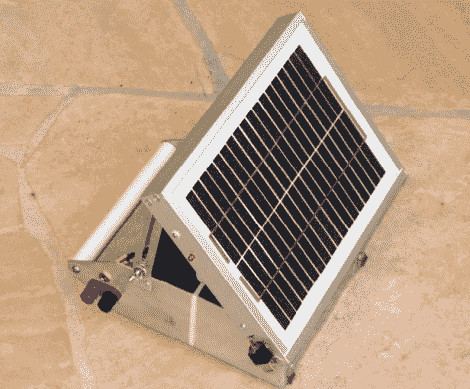

# 用于野外作业的辅助电池组

> 原文：<https://hackaday.com/2011/04/18/auxiliary-battery-pack-for-field-operations/>

Ham 操作员[Ken–wa 4 mnt]写信给我们，分享他几乎每次出外勤都使用的一个小项目。他的[便携式密封铅酸电池组](http://www.qrpbuilder.com/downloads/portable_sla_power.pdf) (PDF)总是确保他在指尖有一个 12v 的电源，无论是为了娱乐还是在紧急情况下。

电池组非常简单，包括一个 12v，17ah 的电池，绑在他制作的轻质铝制底盘上。电池用拉链固定，所以可以很容易地更换电池。该框架还配备了一个可倾斜的 4w，17.5v 太阳能电池板，可以保持电池电量充足，随时准备就绪。他在电池顶部安装了一个伏特计来监视情况，并使用了一个 10A 的保险丝来确保万一出现问题时不会烧坏任何敏感的无线电组件。

当你想到它的时候，电池组是非常紧凑的，我们想象它会很适合在各种户外活动中使用。即使你不喜欢火腿现场操作，也很难否认它在停电时的实用性。

[Ken]似乎没有任何关于底盘或包装电子部分的公开计划，但我们很确定如果有人问起，他会分享的。