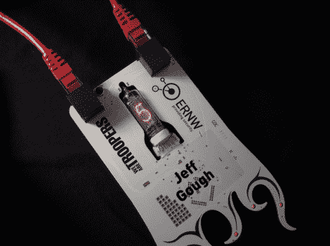

# 数码管会议徽章

> 原文：<https://hackaday.com/2011/04/18/nixie-tube-conference-badge/>

制造商杰弗里·高夫最近被要求为上月在海德堡举行的士兵信息技术安全会议设计一套徽章。徽章将反映今年会议的总体主题-个人进步、教育和努力成为更好的 IT 安全专业人士。为了做到这一点，他设计了一个徽章，用于跟踪与会者参加各种活动的情况。

徽章上有一个安装在中央的数码管，用来显示参加者的分数。它使用 Cat-5 电缆挂在脖子上，作为挂绳以及徽章的电源开关。该徽章可以插入会议组织者使用的特殊程序员，该程序员在完成每个活动后更新与会者的分数。

[Jeffrey]确保在徽章上添加各种额外的好东西，包括通过谢妮显示秘密信息的电容触摸按钮，以及大量的孔和 SMT 垫，以便黑客可以继续他们的游戏。

总体而言，对徽章的接受度非常高。所有与会者都非常喜欢利用徽章以及添加 led 和扬声器等组件。

继续阅读，查看[Jeffrey]制作的快速演示视频，重点介绍徽章的功能。

[https://www.youtube.com/embed/LRaCzuQ2TTQ?version=3&rel=1&showsearch=0&showinfo=1&iv_load_policy=1&fs=1&hl=en-US&autohide=2&wmode=transparent](https://www.youtube.com/embed/LRaCzuQ2TTQ?version=3&rel=1&showsearch=0&showinfo=1&iv_load_policy=1&fs=1&hl=en-US&autohide=2&wmode=transparent)