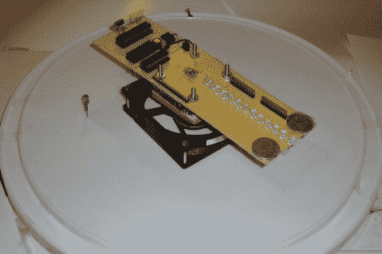

# 在一天内构建一个旋转视点

> 原文：<https://hackaday.com/2011/04/19/build-a-spinning-pov-in-a-day/>

我们喜欢旋转 POV 显示器，但还没有建立一个属于我们自己的显示器。这个项目可能是我们最终建立的项目。它看起来很好，也是我想到的唯一一款可以在 12 小时内完成的视觉暂留显示器。

旋转由电脑风扇负责。这实际上有助于一些计算，因为风扇以已知的转速旋转。这些信息，加上一点几何图形，可以用来计算同步显示的计时器中断。该设备的参考点由一对红外接收器/发射器提供，这很容易布线，因为风扇本身已经需要一个电压源。硬件的其余部分非常常见:电池座位于轴的中心，以实现适当的重量分布，protoboard 容纳了 PIC 18F252、74LS373 数据锁存器和 led 本身等组件。该电路是绕线的，在休息后的剪辑中可以看出，它像一个魔咒一样工作。

[https://www.youtube.com/embed/KWx7Jezz0rM?version=3&rel=1&showsearch=0&showinfo=1&iv_load_policy=1&fs=1&hl=en-US&autohide=2&wmode=transparent](https://www.youtube.com/embed/KWx7Jezz0rM?version=3&rel=1&showsearch=0&showinfo=1&iv_load_policy=1&fs=1&hl=en-US&autohide=2&wmode=transparent)

[via [被黑的小工具](http://hackedgadgets.com/2011/04/16/pov-propeller-clock/)