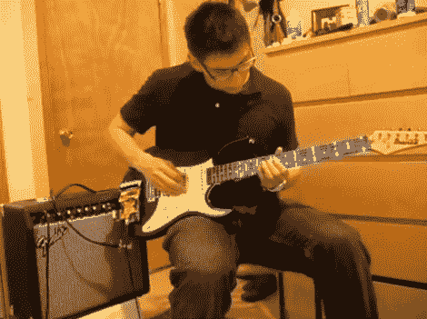

# 吉他教你使用发光二极管演奏

> 原文：<https://hackaday.com/2011/04/19/guitar-teaches-you-to-play-using-leds/>

[Andrew]是 UIC 大学电气工程专业的学生，他决定为自己的高级设计项目制作一把 MIDI 吉他。经过一段时间的修补，事情看起来并不好，MIDI 吉他的想法被废弃。随着最后期限的临近，他想出了一个新主意，吉他演奏。他的新项目是一把吉他，通过嵌入吉他颈部的 led 向你显示正确的音符，教你如何弹奏和弦和音阶。

他移除了颈部，并小心翼翼地钻了一些孔，这些孔最终将容纳他的 130 多个 led。led 通过位于吉他主体背面的一些多路复用电路连接到他的 Arduino。Arduino 安装在吉他的前面，还有一个用于与 LED 阵列通信的护罩。他建造了另一个盾牌，作为液晶显示器以及他的吉他的输入板。

他所有工作的最终结果都很棒。用户只需拨入他想要学习的和弦或音阶，吉他就会亮起，显示手指在指板上的正确位置。我们可以看到这对刚开始学习如何玩的人来说非常方便。

查看下面的视频，观看演示和演练[Andrew]突出了他的吉他的功能。

 <https://www.youtube.com/embed/B2s5c1RcswA?version=3&rel=1&showsearch=0&showinfo=1&iv_load_policy=1&fs=1&hl=en-US&autohide=2&wmode=transparent>

 </body> </html>