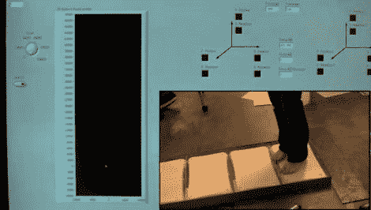

# 用电子游戏教孩子走路

> 原文：<https://hackaday.com/2011/04/19/teaching-children-to-walk-using-video-games/>

妨碍个人行走的医疗条件很难处理，如果病人碰巧是个孩子就更难处理了。Shriner 的医院治疗了许多患有脑瘫、脊柱裂或截肢的儿童。他们总是在寻找创造性的治疗方法，所以他们的运动分析实验室向一些莱斯大学的本科生寻求帮助。他们要求工程师小组设计一个系统，让物理治疗变得更有趣，同时帮助鼓励孩子们。

该团队最近公布了他们的项目，名为 Equiliberator。游戏系统包含一系列五块 Wii 平衡板，位于一对压力感应扶手之间。该平台通过蓝牙与计算机进行通信，记录患者在路径上移动时的动作。该系统的软件部分由一个杀死怪物的游戏组成，该游戏要求孩子踩在道路的特定部分上，以解决迎面而来的敌人。

该游戏旨在随着孩子的平衡和协调能力的提高而变得更加困难，并随着他们的进步不断增加积分来鼓励他们。该项目的最终目标是使压敏扶手能够确定儿童在多大程度上依赖它们来保持平衡，从而在游戏中提供尽可能少的支撑来行走的激励。

我们喜欢看到这样的黑客，他们不仅娱乐，而且在这个过程中真正帮助了人们。莱斯大学的团队值得称赞——他们在这里做了出色的工作。

继续阅读，观看用设计师自己的话描述 Equiliberator 的快速视频。

[via [MedGadget](http://www.medgadget.com/archives/2011/04/students_use_wii_balance_boards_to_create_balance_training_system_for_kids.html)

 <https://www.youtube.com/embed/TcDUL_O4-GU?version=3&rel=1&showsearch=0&showinfo=1&iv_load_policy=1&fs=1&hl=en-US&autohide=2&wmode=transparent>

 </body> </html>