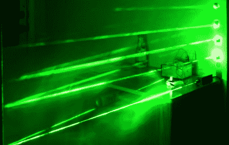

# 激光绊线——最基本的东西

> 原文：<https://hackaday.com/2011/04/19/laser-trip-wire-the-bare-essentials/>

[Gordon]在阅读了昨天关于[一个更复杂的激光安全装置](http://hackaday.com/2011/04/18/laser-tripwire-alarm-system-uses-mirrors-to-increase-coverage/)的帖子后，给了我们一个关于[这个简单的激光绊线系统](http://thetimmy.tk/pages/laser_tripwire/)的提示。该版本做了大量工作来提供功能，如解除绊网的系统和强大的光检测电路。这一次，烟雾和镜子比电子产品发生得更多。

[提米]基于来自 Afrotechmods 的激光旅行系统[建造了这个更简单的版本(视频在休息后嵌入)。他有一个装满方形小镜子的包，用海报油灰把它贴在墙上。激光模块将一束光在光网络中反射一段时间后，照射到硫化镉传感器上。该 CdS 传感器控制一个 N 沟道 MOSFET，当检测到光时将其关闭，当没有激光强度时将其打开。这个例子只是打开和关闭 LED，但由于它使用逻辑电平电压，如果您有其他计划，可以选择添加一个微控制器。](http://afrotechmods.com/forums/index.php/topic,7990.0.html)

[https://www.youtube.com/embed/BNfGoy5dqbg?version=3&rel=1&showsearch=0&showinfo=1&iv_load_policy=1&fs=1&hl=en-US&autohide=2&wmode=transparent](https://www.youtube.com/embed/BNfGoy5dqbg?version=3&rel=1&showsearch=0&showinfo=1&iv_load_policy=1&fs=1&hl=en-US&autohide=2&wmode=transparent)