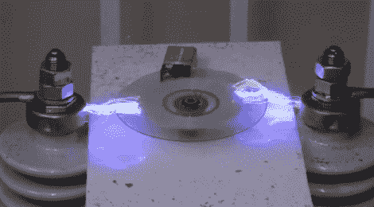

# 高压钻机将光盘擦拭干净

> 原文：<https://hackaday.com/2011/04/19/high-voltage-rig-wipes-cds-clean/>

在 Hackaday，我们不反对仅仅为了展示而展示无端破坏的视频，尽管我们试图不让这成为一种习惯。在这种情况下，我们就是控制不住自己。然而，这个视频在技术上构成了一个安全黑客，因为它确实涉及到从光盘上删除敏感信息…

[…用牛逼！](http://www.youtube.com/watch?v=Zi_bMYFmFGg)

这可能是我们见过的最酷的 CD 橡皮擦了。放置在两个高压变压器之间，旋转的光盘在几秒钟内就能猛烈地剥离其数据。公平地说，数据本身并没有被擦除，但记录数据的金属基底被电的侵蚀性应用剥落了。

这些年来，我们在微波炉里销毁了相当份额的 AOL CDs，现在我们对它们被如此平淡地处理感到有点难过——如果我们身边有一个这样的 CD 就好了！

既然我们的话题是盲目毁灭，你不妨花几分钟看看这个[铝热剂烤感恩节火鸡](http://hackaday.com/2010/11/25/thanksgiving-with-thermite/)，这个[自毁硬盘](http://hackaday.com/2010/07/04/hard-drive-destruction-plan/)，或者这个用意大利面条做成的[热枪](http://hackaday.com/2011/02/11/thermic-lance-made-from-spaghetti/)。

你知道，为了科学。

 <https://www.youtube.com/embed/Zi_bMYFmFGg?version=3&rel=1&showsearch=0&showinfo=1&iv_load_policy=1&fs=1&hl=en-US&autohide=2&wmode=transparent>

 </body> </html>