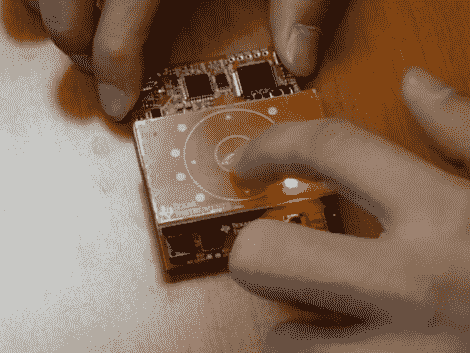

# TI Launchpad 的电容式触摸传感器屏蔽

> 原文：<https://hackaday.com/2011/04/20/capacitive-touch-sensor-shield-for-the-ti-launchpad/>

德州仪器(Texas Instruments)刚刚发布了一款产品，他们称之为[电容式触摸助推器包，基本上是发射台](http://e2e.ti.com/group/msp430launchpad/b/boosterpacks/archive/2011/04/17/430boost_2d00_sense1.aspx)的触摸感应屏蔽。广告之后的视频展示了 TI 以 4.30 美元的限时价格推出的产品的拆箱和演示。红色 PCB 本身在中心有一个电容触摸按钮，周围有一个触摸滚轮，它位于接近传感器的中心，占据了电路板的其余部分。还有九个 led 看起来像是焊接在电路板的下侧，通过布线孔安装在与顶面齐平的位置。该包还配有一个新的 MSP430 微控制器，[g 2452](http://focus.ti.com/docs/prod/folders/print/msp430g2452.html)，它有 8 KB 的闪存，并负责校准、读取和处理来自电路板的信号，这要归功于附加套件附带的软件包。

看起来很不错。在这个硬件的文档中有大量的信息。我们确实希望能更容易地找到电路板布局信息，但我们确信它就在某个地方。

 <https://www.youtube.com/embed/W_q2_iDhsd8?version=3&rel=1&showsearch=0&showinfo=1&iv_load_policy=1&fs=1&hl=en-US&autohide=2&wmode=transparent>

 
【感谢 t11r via <a href="http://www.43oh.com/2011/04/launchpad-capacitive-touch-booster-pack/" target="_blank">四三哦！</a> ]
 </body> </html>