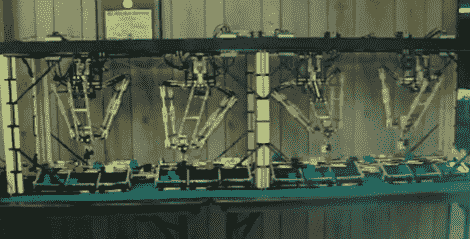

# 令人惊叹的四重拾放系统不知疲倦地整理您的乐高积木

> 原文：<https://hackaday.com/2011/04/20/amazing-quad-pick-and-place-system-tirelessly-sorts-your-legos/>

[克里斯]是相当投入的修补匠。他最近来信分享了只能被描述为爱的劳动。他的 Quad Delta 机器人系统已经工作了大约六年，分为研究、建造、更多研究和重建阶段，直到达到目前的形式。

该系统由四个乐高 NXT 机器人组成，它们的任务是在乐高立方体从一对传送带上下来时，按颜色对它们进行分类。这些机器人是模仿世界各地装配线上的商用取放机器人制造的。

每个机器人独立操作，通过光传感器接收信号，告诉机器人下一块砖在哪里，以及它是什么颜色。该数据由主 NXT 单元发送，它使用光传感器来确定砖块的颜色和位置，通过闪烁的 led 将信息传递给其他机器人。所有的机器人都接收到相同的信号，但就像网卡忽略不是发往它们 MAC 的帧一样，机器人忽略不是发给它们的消息。

这台机器看起来真的很棒——很明显,(克里斯的)所有研究和计划都得到了回报。你必须看看下面的视频，才能真正体会到这个系统所付出的努力。此外，一定要访问他的网站，更深入地了解机器是如何工作的，这绝对值得花时间。

 <https://www.youtube.com/embed/7VxCl6w3HS0?version=3&rel=1&showsearch=0&showinfo=1&iv_load_policy=1&fs=1&hl=en-US&autohide=2&wmode=transparent>

 </body> </html>