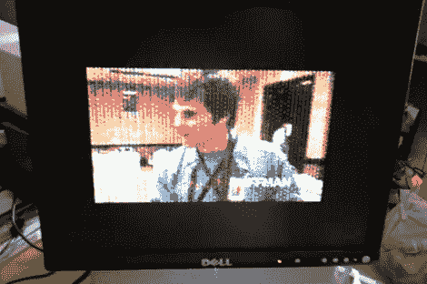

# Tandy 彩色计算机(CoCo3)彩色视频回放

> 原文：<https://hackaday.com/2011/04/21/tandy-color-computer-coco3-color-video-playback/>

约翰·w·林维尔为坦迪彩色电脑(又名 TRS-80)编写了一个数字视频播放器。考虑到他必须使用的有限资源，这个几十年前的硬件表现得相当好。这是他的播放器的第二次迭代，可以在休息后看到为 [CoCoFEST 2011](http://www.glensideccc.com/) 播放的宣传视频，他将亲自展示它。

在最近的一篇帖子中(在撰写本文时)，John 分享了用于运行这个的[方法。FFMPEG 在现代计算机上用于处理源视频，将音频分离为 8 位 11040Hz 文件，并以适当的视频帧速率生成多个 PPM 文件。ImageMagick 从那里把 PPM 文件转换成位图格式。它还处理每个帧的差异变化，将大小减小到可用带宽范围内。然后，它们与音频交织在一起，产生最终的格式。视频为 128×192，像素为矩形。(约翰的)已经用它在过时的硬件上观看经典的战争游戏。](http://five.pairlist.net/pipermail/coco/2011-April/054146.html)

 <https://www.youtube.com/embed/42jBBrqn70w?version=3&rel=1&showsearch=0&showinfo=1&iv_load_policy=1&fs=1&hl=en-US&autohide=2&wmode=transparent>

 </body> </html>