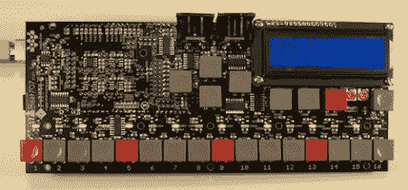

# Beat707 的灵感来自一台老式鼓机

> 原文：<https://hackaday.com/2011/04/22/beat707-takes-its-cue-from-a-vintage-drum-machine/>

我们总是喜欢 hackaday 的音乐黑客，所以我们很高兴看到[Beat707]的团队推出了他们的[beat 707](http://www.beat707.com/w/component/content/article/40-beat707/73-welcome-to-beat707com)MIDI groove box。

Beat707 的灵感来自古老的罗兰 TR-707。像罗兰一样，Beat707 可以保存歌曲，并有 MIDI 输入和输出。与 TR-707 不同，Beat707 没有音频输出，它完全基于 MIDI。不过，不要认为这是一个缺点。只需将 Beat707 连接到您最喜爱的 softsynth，然后开始播放。

罗兰 TR-707 被化学兄弟、Aphex 双胞胎和 Cocteau 双胞胎等公司大量使用。由于这段历史，TR-707 的受欢迎程度在过去几年里激增，获得一架真正的 TR-707 是一个昂贵的提议。虽然重建像[Ladyada]的 TB-303 克隆、[0x xb0x](//www.ladyada.net/make/x0xb0x/)这样的老式合成器已经有一段时间了，但我们很高兴更多的项目正在向 20 世纪 80 年代的伟大音乐机器支付它们的费用。有没有黑客读者想为他们的下一个项目解决一个 [808](http://www.vintagesynth.com/roland/808.php) 或 [909](http://www.vintagesynth.com/roland/909.php) 的问题？

休息后的 Beat707 视频。

 <https://www.youtube.com/embed/aU1Mo97dq3M?version=3&rel=1&showsearch=0&showinfo=1&iv_load_policy=1&fs=1&hl=en-US&autohide=2&wmode=transparent>

 </body> </html>